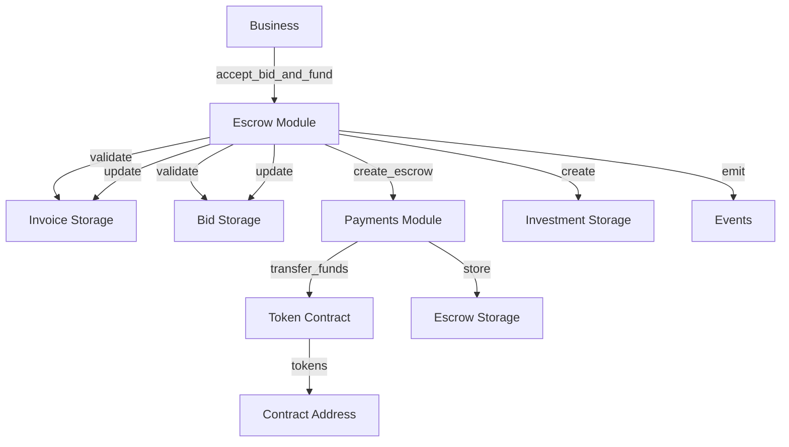

# Design Document: Accept Bid and Fund

## Overview

The `accept_bid_and_fund` feature is a critical operation in the QuickLendX smart contract that enables businesses to accept investor bids and establish secure funding through an escrow mechanism. This operation must be atomic, secure against reentrancy attacks, and maintain consistency across multiple state changes including bid status, invoice status, escrow creation, and investment record creation.

The implementation builds upon the existing architecture in `src/escrow.rs`, which already contains the core `accept_bid_and_fund` function. This design document formalizes the requirements, identifies correctness properties, and establishes a comprehensive testing strategy to ensure the implementation meets all security and functional requirements.

## Architecture

### System Components

The accept_bid_and_fund operation involves coordination between five main modules:

1. **Escrow Module** (`src/escrow.rs`): Contains the main `accept_bid_and_fund` function and `refund_escrow_funds` function
2. **Payments Module** (`src/payments.rs`): Handles token transfers and escrow record management
3. **Bid Module** (`src/bid.rs`): Manages bid state and validation
4. **Invoice Module** (`src/invoice.rs`): Manages invoice state transitions
5. **Investment Module** (`src/investment.rs`): Creates and tracks investment records
6. **Reentrancy Guard** (`src/reentrancy.rs`): Provides security against recursive calls

### Control Flow

```
Business calls accept_bid_and_fund(invoice_id, bid_id)
    ↓
[Reentrancy Guard Activated]
    ↓
Validate: Business is invoice owner (require_auth)
    ↓
Validate: Invoice status is Verified
    ↓
Validate: Bid status is Placed
    ↓
Validate: Bid matches invoice
    ↓
Validate: Bid not expired
    ↓
Create Escrow (transfer tokens investor → contract)
    ↓
Update Bid status: Placed → Accepted
    ↓
Update Invoice status: Verified → Funded
    ↓
Create Investment record
    ↓
Emit Events (BidAccepted, EscrowCreated, InvoiceFunded)
    ↓
[Reentrancy Guard Deactivated]
    ↓
Return escrow_id
```

### Data Flow



## Components and Interfaces

### Primary Function: accept_bid_and_fund

**Location**: `src/escrow.rs`

**Signature**:
```rust
pub fn accept_bid_and_fund(
    env: &Env,
    invoice_id: &BytesN<32>,
    bid_id: &BytesN<32>,
) -> Result<BytesN<32>, QuickLendXError>
```

**Parameters**:
- `env`: Soroban environment for blockchain operations
- `invoice_id`: Unique identifier for the invoice
- `bid_id`: Unique identifier for the bid to accept

**Returns**:
- `Ok(escrow_id)`: The newly created escrow identifier
- `Err(QuickLendXError)`: Specific error indicating failure reason

**Authorization**: Requires `invoice.business.require_auth()` - only the business owner can accept bids

### Supporting Functions

#### create_escrow (payments.rs)

```rust
pub fn create_escrow(
    env: &Env,
    invoice_id: &BytesN<32>,
    investor: &Address,
    business: &Address,
    amount: i128,
    currency: &Address,
) -> Result<BytesN<32>, QuickLendXError>
```

Transfers tokens from investor to contract and creates escrow record.

#### transfer_funds (payments.rs)

```rust
pub fn transfer_funds(
    env: &Env,
    currency: &Address,
    from: &Address,
    to: &Address,
    amount: i128,
) -> Result<(), QuickLendXError>
```

Executes token transfer using allowance mechanism.

#### with_payment_guard (reentrancy.rs)

```rust
pub fn with_payment_guard<F, R>(env: &Env, f: F) -> Result<R, QuickLendXError>
where
    F: FnOnce() -> Result<R, QuickLendXError>
```

Wraps operations with reentrancy protection.

## Data Models

### Escrow

```rust
pub struct Escrow {
    pub escrow_id: BytesN<32>,
    pub invoice_id: BytesN<32>,
    pub investor: Address,
    pub business: Address,
    pub amount: i128,
    pub currency: Address,
    pub created_at: u64,
    pub status: EscrowStatus,
}

pub enum EscrowStatus {
    Held,     // Funds locked in escrow
    Released, // Funds released to business
    Refunded, // Funds returned to investor
}
```

### Bid

```rust
pub struct Bid {
    pub bid_id: BytesN<32>,
    pub invoice_id: BytesN<32>,
    pub investor: Address,
    pub bid_amount: i128,
    pub expected_return: i128,
    pub timestamp: u64,
    pub status: BidStatus,
    pub expiration_timestamp: u64,
}

pub enum BidStatus {
    Placed,
    Withdrawn,
    Accepted,
    Expired,
    Cancelled,
}
```

### Investment

```rust
pub struct Investment {
    pub investment_id: BytesN<32>,
    pub invoice_id: BytesN<32>,
    pub investor: Address,
    pub amount: i128,
    pub funded_at: u64,
    pub status: InvestmentStatus,
    pub insurance: Vec<InsuranceCoverage>,
}

pub enum InvestmentStatus {
    Active,
    Withdrawn,
    Completed,
    Defaulted,
    Refunded,
}
```

### Invoice (relevant fields)

```rust
pub struct Invoice {
    pub id: BytesN<32>,
    pub business: Address,
    pub amount: i128,
    pub currency: Address,
    pub status: InvoiceStatus,
    // ... other fields
}

pub enum InvoiceStatus {
    Pending,
    Verified,
    Funded,
    Paid,
    Defaulted,
    Cancelled,
    Refunded,
}
```

## Correctness Properties

*A property is a characteristic or behavior that should hold true across all valid executions of a system-essentially, a formal statement about what the system should do. Properties serve as the bridge between human-readable specifications and machine-verifiable correctness guarantees.*

### Property 1: Authorization enforcement

*For any* invoice and bid, when accept_bid_and_fund is called, the operation should succeed only if the caller is the invoice owner
**Validates: Requirements 1.1**

### Property 2: Bid status validation

*For any* bid, accept_bid_and_fund should succeed only when the bid status is Placed (not Withdrawn, Accepted, Expired, or Cancelled)
**Validates: Requirements 1.2, 6.1, 6.2, 6.3**

### Property 3: Invoice status validation

*For any* invoice, accept_bid_and_fund should succeed only when the invoice status is Verified (not Pending, Funded, Paid, Defaulted, or Cancelled)
**Validates: Requirements 1.3, 6.4**

### Property 4: Bid-invoice matching

*For any* bid and invoice, accept_bid_and_fund should succeed only when the bid's invoice_id matches the provided invoice_id
**Validates: Requirements 1.2**

### Property 5: Bid expiration validation

*For any* bid, accept_bid_and_fund should fail if the current timestamp exceeds the bid's expiration_timestamp
**Validates: Requirements 1.2, 6.3**

### Property 6: Atomic state transitions

*For any* successful accept_bid_and_fund operation, all of the following must occur: bid status becomes Accepted, invoice status becomes Funded, escrow is created with status Held, and investment record is created with status Active
**Validates: Requirements 1.4, 1.5, 2.1, 2.3, 3.1, 4.4**

### Property 7: Atomic failure rollback

*For any* failed accept_bid_and_fund operation, none of the state changes should persist (bid status, invoice status, escrow, investment)
**Validates: Requirements 4.1, 4.2, 4.3, 4.5**

### Property 8: Token transfer correctness

*For any* successful accept_bid_and_fund operation, exactly bid_amount tokens should be transferred from investor to contract address
**Validates: Requirements 2.2**

### Property 9: Escrow record correctness

*For any* created escrow, the escrow amount should equal the bid amount, the investor should match the bid investor, and the business should match the invoice business
**Validates: Requirements 2.1, 2.4, 2.5**

### Property 10: Investment record correctness

*For any* created investment, the investment amount should equal the bid amount, the investor should match the bid investor, and the invoice_id should match the provided invoice_id
**Validates: Requirements 3.2, 3.3, 3.4**

### Property 11: Reentrancy protection

*For any* concurrent calls to accept_bid_and_fund, only one should execute at a time, and any reentrant call should fail with OperationNotAllowed error
**Validates: Requirements 5.1, 5.2, 5.3, 5.4**

### Property 12: Amount validation

*For any* bid with amount <= 0, accept_bid_and_fund should fail with InvalidAmount error
**Validates: Requirements 7.3, 7.4**

### Property 13: Entity existence validation

*For any* non-existent invoice_id or bid_id, accept_bid_and_fund should fail with appropriate error (InvoiceNotFound or StorageKeyNotFound)
**Validates: Requirements 7.1, 7.2**

### Property 14: Insufficient balance handling

*For any* investor with token balance less than bid_amount, accept_bid_and_fund should fail with InsufficientFunds error
**Validates: Requirements 7.5**

### Property 15: Single funding per invoice

*For any* invoice, only one bid can be accepted (once invoice is Funded, no additional bids can be accepted)
**Validates: Requirements 6.4, 6.5**

### Property 16: Event emission on success

*For any* successful accept_bid_and_fund operation, BidAccepted, EscrowCreated, and InvoiceFunded events should be emitted with correct parameters
**Validates: Requirements 8.1, 8.2, 8.3, 8.4**

### Property 17: No events on failure

*For any* failed accept_bid_and_fund operation, no events should be emitted
**Validates: Requirements 8.5**

## Error Handling

### Error Types

The function returns `Result<BytesN<32>, QuickLendXError>` with the following error cases:

| Error | Condition | HTTP Analogy |
|-------|-----------|--------------|
| `InvoiceNotFound` | Invoice ID doesn't exist | 404 Not Found |
| `StorageKeyNotFound` | Bid ID doesn't exist | 404 Not Found |
| `Unauthorized` | Caller is not invoice owner or bid doesn't match invoice | 403 Forbidden |
| `InvalidStatus` | Bid not Placed or expired | 400 Bad Request |
| `InvoiceAlreadyFunded` | Invoice already in Funded status | 409 Conflict |
| `InvoiceNotAvailableForFunding` | Invoice not in Verified status | 400 Bad Request |
| `InvalidAmount` | Bid amount <= 0 | 400 Bad Request |
| `InsufficientFunds` | Investor lacks token balance | 402 Payment Required |
| `OperationNotAllowed` | Reentrancy detected or insufficient allowance | 409 Conflict |

### Error Recovery

All errors result in complete transaction rollback - no partial state changes persist. The Soroban runtime ensures atomicity at the transaction level.

### Validation Order

Validations are ordered to fail fast and minimize gas costs:

1. Entity existence (invoice, bid)
2. Authorization (business ownership)
3. Status checks (invoice Verified, bid Placed)
4. Business logic (bid matches invoice, not expired)
5. Financial checks (amount > 0, sufficient balance)
6. State mutations (escrow creation, status updates)

## Testing Strategy

### Dual Testing Approach

The implementation requires both unit tests and property-based tests:

- **Unit tests** verify specific examples, edge cases, and error conditions
- **Property tests** verify universal properties that should hold across all inputs
- Together they provide comprehensive coverage: unit tests catch concrete bugs, property tests verify general correctness

### Property-Based Testing

**Framework**: `proptest` crate for Rust

**Configuration**: Each property test should run a minimum of 100 iterations

**Test Tagging**: Each property-based test must include a comment explicitly referencing the correctness property:
```rust
// Feature: accept-bid-and-fund, Property 1: Authorization enforcement
```

### Unit Testing

Unit tests should cover:

1. **Happy path**: Valid bid acceptance with all state transitions
2. **Authorization failures**: Non-owner attempting to accept bid
3. **Status validation**: Bid in Withdrawn/Accepted/Expired state
4. **Status validation**: Invoice in Pending/Funded/Paid state
5. **Bid-invoice mismatch**: Bid for different invoice
6. **Expired bid**: Current time > expiration_timestamp
7. **Amount validation**: Zero or negative bid amount
8. **Entity not found**: Non-existent invoice or bid ID
9. **Insufficient balance**: Investor lacks tokens
10. **Double accept prevention**: Attempting to accept same bid twice
11. **Multiple bids**: Only one bid can be accepted per invoice
12. **Reentrancy**: Concurrent calls should be blocked
13. **Event emission**: Verify correct events on success
14. **No events on failure**: Verify no events on error

### Integration Testing

Integration tests should verify:

1. **End-to-end flow**: Invoice creation → verification → bid placement → acceptance → settlement
2. **Refund flow**: Accept bid → refund escrow → verify state rollback
3. **Multiple investors**: Several bids on one invoice, only one accepted
4. **Token integration**: Actual token transfers with mock token contract

### Test File Organization

- **Unit tests**: `src/test_escrow.rs` (existing file to be enhanced)
- **Property tests**: `src/test_escrow.rs` (add property test module)
- **Integration tests**: `src/test_escrow.rs` (add integration test module)

### Coverage Goals

- Line coverage: > 90%
- Branch coverage: > 85%
- All error paths tested
- All correctness properties validated

## Security Considerations

### Reentrancy Protection

The `with_payment_guard` wrapper in `src/reentrancy.rs` prevents recursive calls:

```rust
pub fn with_payment_guard<F, R>(env: &Env, f: F) -> Result<R, QuickLendXError>
```

This guard must wrap the public entry point in `lib.rs`:

```rust
pub fn accept_bid_and_fund_public(
    env: Env,
    invoice_id: BytesN<32>,
    bid_id: BytesN<32>,
) -> Result<BytesN<32>, QuickLendXError> {
    with_payment_guard(&env, || {
        accept_bid_and_fund(&env, &invoice_id, &bid_id)
    })
}
```

### Authorization Model

- **Business authorization**: `invoice.business.require_auth()` ensures only the invoice owner can accept bids
- **Investor authorization**: Token transfer uses allowance mechanism, requiring prior approval
- **Admin bypass**: No admin override for bid acceptance (business-only operation)

### Token Transfer Security

1. **Check-Effects-Interactions Pattern**: All state validations occur before token transfer
2. **Allowance verification**: `transfer_funds` checks allowance before transfer
3. **Balance verification**: Checks investor balance before attempting transfer
4. **Atomic execution**: Soroban transaction atomicity ensures all-or-nothing execution

### State Consistency

1. **Unique escrow per invoice**: Invoice-to-escrow mapping prevents duplicate escrows
2. **Unique investment per invoice**: Invoice-to-investment mapping prevents duplicate investments
3. **Status transitions**: Bid Placed→Accepted and Invoice Verified→Funded are one-way
4. **Index consistency**: Bid and investment indices updated atomically with records

### Audit Trail

The implementation leverages existing audit logging:

```rust
invoice.mark_as_funded(env, investor, amount, timestamp);
```

This creates an audit log entry for the funding event.

## Performance Considerations

### Gas Optimization

1. **Early validation**: Fail fast on cheap checks before expensive operations
2. **Minimal storage reads**: Cache invoice and bid after initial retrieval
3. **Efficient ID generation**: Use timestamp + counter for unique IDs
4. **Batch updates**: Update all related state in single transaction

### Storage Efficiency

1. **Index structures**: Use symbol-based keys for efficient lookups
2. **No redundant data**: Escrow and investment reference invoice/bid by ID
3. **Status enums**: Use compact enum representation for status fields

### Scalability

1. **Per-invoice isolation**: Operations on different invoices don't interfere
2. **No global locks**: Reentrancy guard is per-transaction, not global
3. **Bounded iteration**: No unbounded loops in critical path

## Documentation Requirements

### Code Documentation

1. **Module-level docs**: Explain escrow flow and security model
2. **Function docs**: Document parameters, returns, errors, and security considerations
3. **Inline comments**: Explain non-obvious validation logic and state transitions

### External Documentation

Update `docs/contracts/escrow.md` with:

1. **Operation overview**: What accept_bid_and_fund does
2. **Prerequisites**: Invoice must be Verified, bid must be Placed
3. **State changes**: Document all state transitions
4. **Error scenarios**: List all possible errors and causes
5. **Security notes**: Reentrancy protection, authorization model
6. **Example usage**: Code snippets showing typical flow
7. **Integration guide**: How to integrate with frontend/backend

## Implementation Notes

### Existing Implementation

The core `accept_bid_and_fund` function already exists in `src/escrow.rs` with the following implementation:

- ✅ Authorization check (business owner)
- ✅ Invoice status validation (Verified)
- ✅ Bid status validation (Placed)
- ✅ Bid-invoice matching
- ✅ Bid expiration check
- ✅ Escrow creation via `create_escrow`
- ✅ Bid status update (Placed → Accepted)
- ✅ Invoice status update (Verified → Funded)
- ✅ Investment record creation
- ✅ Event emission

### Implementation Gaps

Based on requirements analysis, the following need verification/enhancement:

1. **Reentrancy guard**: Verify public entry point wraps with `with_payment_guard`
2. **Test coverage**: Comprehensive unit and property tests needed
3. **Documentation**: Update `docs/contracts/escrow.md`
4. **Error handling**: Verify all error cases are properly handled
5. **Event emission**: Verify all required events are emitted

### Refund Flow

The `refund_escrow_funds` function provides the inverse operation:

- Validates caller is admin or business owner
- Checks invoice is in Funded status
- Transfers tokens from contract back to investor
- Updates escrow status to Refunded
- Updates invoice status to Refunded
- Updates bid status to Cancelled
- Updates investment status to Refunded
- Emits refund event

This provides a safety mechanism for canceling funded invoices.

## Future Enhancements

### Potential Improvements

1. **Partial funding**: Allow multiple bids to fund portions of an invoice
2. **Bid ranking**: Automatically accept best bid based on ranking algorithm
3. **Time locks**: Add minimum holding period before refund
4. **Fee integration**: Deduct platform fees during escrow creation
5. **Multi-currency**: Support multiple token types per invoice
6. **Batch operations**: Accept multiple bids in single transaction

### Backward Compatibility

Any future changes must maintain:

- Existing function signatures for public API
- Storage key formats for existing data
- Event structures for external integrations
- Error codes for client error handling

## Conclusion

The accept_bid_and_fund feature is a well-architected, security-focused operation that coordinates multiple system components to enable safe invoice funding. The existing implementation in `src/escrow.rs` provides a solid foundation. This design document formalizes the requirements, establishes correctness properties, and defines a comprehensive testing strategy to ensure the implementation meets all functional and security requirements.

The key to successful implementation is:

1. **Atomicity**: All state changes succeed or fail together
2. **Security**: Reentrancy protection and authorization enforcement
3. **Validation**: Comprehensive checks before state mutations
4. **Testing**: Both unit and property-based tests for complete coverage
5. **Documentation**: Clear explanation of operation, errors, and security model
