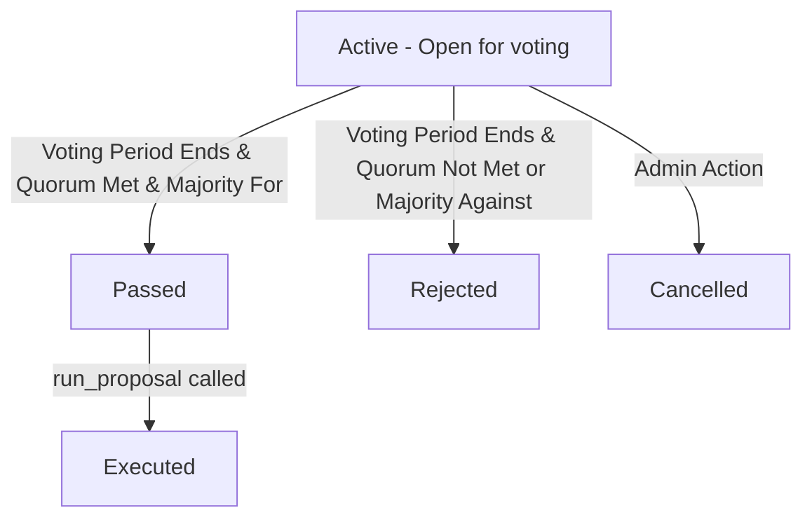

# Governance Proposal Lifecycle (Operator Guide)

This guide documents the lifecycle, statuses, and execution flow of governance proposals in the QuickLendX protocol. It is intended for protocol operators, validators, and administrators who submit or interact with governance proposals on-chain.

## Overview
QuickLendX uses a pluggable governance model via the `Governable` trait. Any contract module can support a consistent proposal/voting/execution lifecycle.



## Proposal Statuses
A proposal on-chain can have one of the following statuses (`ProposalStatus`):
- `Active`: Submitted and currently open for voting.
- `Passed`: Quorum has been met and there are more votes in favor than against. Ready to be executed.
- `Rejected`: Voting is closed and either quorum was not met or votes against exceeded or equaled votes in favor.
- `Executed`: The proposal passed and its on-chain action was successfully executed.
- `Cancelled`: Preemptively cancelled by the proposer or a protocol administrator.

## Step-by-Step Operator Workflow

### 1. Submitting a Proposal
To submit a new proposal on-chain, invoke `submit_proposal` from the contract client. This requires authorization from the proposer.

**Rust Entrypoint Signature:**
```rust
fn submit_proposal(
    env: &Env,
    proposer: &Address,
    proposal_id: BytesN<32>,
) -> Result<Proposal, QuickLendXError>;
```

**Concrete example:**
```rust
// Proposer's identity
let proposer = Address::from_string(&env, "G...");
// Unique 32-byte hash identifying the upgrade/action
let proposal_id = BytesN::from_array(&env, &[1u8; 32]);

let proposal = client.submit_proposal(&proposer, &proposal_id);
// proposal.status is now ProposalStatus::Active
```

---

### 2. Casting Votes
Voters can cast votes (either in favor or against) during the active voting period. Double-voting is prevented by recording the voter's address.

**Rust Entrypoint Signature:**
```rust
fn cast_vote(
    env: &Env,
    voter: &Address,
    proposal_id: &BytesN<32>,
    in_favour: bool,
) -> Result<(), QuickLendXError>;
```

**Concrete example:**
```rust
let voter = Address::from_string(&env, "G...");
client.cast_vote(&voter, &proposal_id, &true); // Vote in favor
```

---

### 3. Finalization and Execution
Once the voting period (in ledger sequences) has elapsed, anyone can finalize the proposal. If it passes, it is ready to run.

**Rust Entrypoint Signatures:**
```rust
fn finalize_proposal(
    env: &Env,
    proposal_id: &BytesN<32>,
) -> Result<ProposalStatus, QuickLendXError>;

fn run_proposal(
    env: &Env,
    proposal_id: &BytesN<32>,
) -> Result<(), QuickLendXError>;
```

**Concrete example:**
```rust
// Verify current status
let status = client.finalize_proposal(&proposal_id);

// Execute on-chain changes (will auto-finalize if still Active and time is up)
client.run_proposal(&proposal_id);
```
