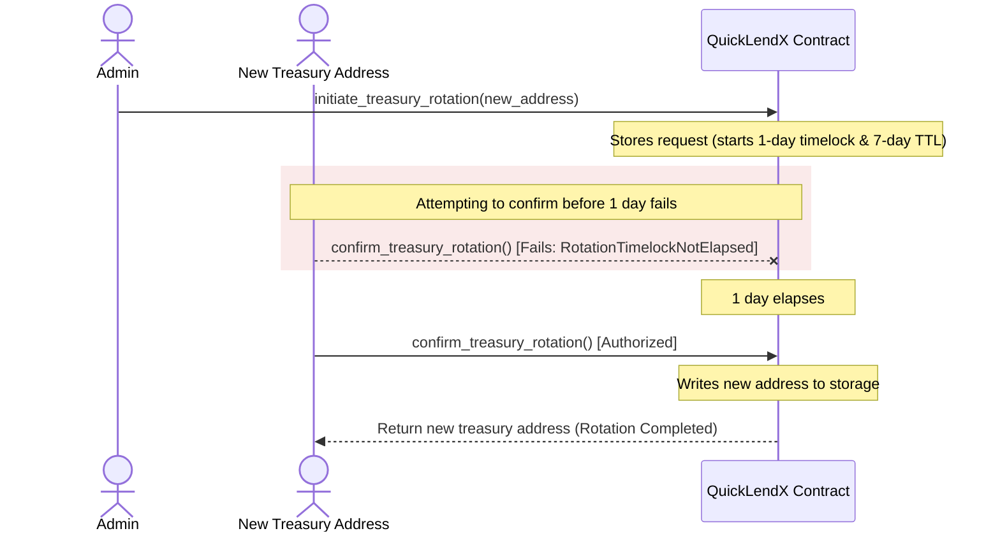

# Treasury Address Rotation Flow (Operator Guide)

This guide documents the security model and execution steps for rotating the treasury address in the QuickLendX protocol. It is intended for protocol operators and administrators.

## Security Model (Two-Step Verification with Timelock)
To prevent key compromise, accidental transfers, or unauthorized treasury updates, QuickLendX implements a strict two-step verification flow with an enforced timelock.

- **Two-Step Verification:** An admin initiates the rotation on-chain, but the new treasury address must explicitly confirm the rotation to prove control before the update is committed.
- **Timelock Delay:** A minimum delay of **1 day** (`MIN_ROTATION_DELAY_SECONDS` = 86,400 seconds) is enforced between initiation and confirmation. This gives validators and the community time to audit the action and lets the admin cancel if needed.
- **TTL Expiry:** A maximum TTL of **7 days** (`ROTATION_TTL_SECONDS` = 604,800 seconds) is enforced. If the new address does not confirm the rotation within this window, the request expires and is discarded.



## Step-by-Step Operator Workflow

### 1. Initiating the Rotation
The protocol administrator calls `initiate_treasury_rotation` with the proposed new treasury address.

**Rust Entrypoint Signature:**
```rust
pub fn initiate_treasury_rotation(
    env: &Env,
    admin: &Address,
    new_address: Address,
) -> Result<RecipientRotationRequest, QuickLendXError>;
```

**Concrete example:**
```rust
let admin = Address::from_string(&env, "G_ADMIN...");
let new_treasury = Address::from_string(&env, "G_NEW_TREASURY...");

let request = client.initiate_treasury_rotation(&admin, &new_treasury);
// request.confirmation_deadline is now set to 7 days from now
```

---

### 2. Waiting for the Timelock
After initiating, you must wait at least **1 day** (86,400 seconds) for the timelock to elapse. Attempting to confirm early will result in a `RotationTimelockNotElapsed` error.

---

### 3. Confirming the Rotation
The proposed `new_address` must authorize the confirmation call. This verifies that the destination address is active and can sign transactions before any funds are routed to it.

**Rust Entrypoint Signature:**
```rust
pub fn confirm_treasury_rotation(
    env: &Env,
    new_address: &Address,
) -> Result<Address, QuickLendXError>;
```

**Concrete example:**
```rust
let new_treasury = Address::from_string(&env, "G_NEW_TREASURY...");
// Called by/authorized by the new treasury address
let final_address = client.confirm_treasury_rotation(&new_treasury);
// Treasury is now updated in PLATFORM_FEE_KEY config
```

---

### 4. Cancelling the Rotation
At any point before the rotation is confirmed, the administrator can cancel the pending request.

**Rust Entrypoint Signature:**
```rust
pub fn cancel_treasury_rotation(
    env: &Env,
    admin: &Address,
) -> Result<(), QuickLendXError>;
```

**Concrete example:**
```rust
let admin = Address::from_string(&env, "G_ADMIN...");
client.cancel_treasury_rotation(&admin);
// Pending request is removed from storage
```
