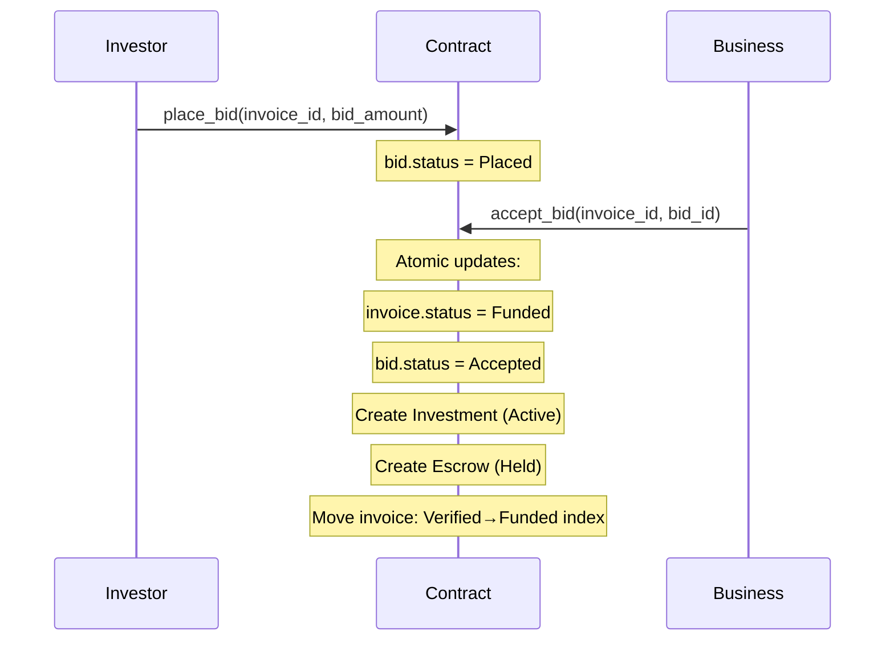
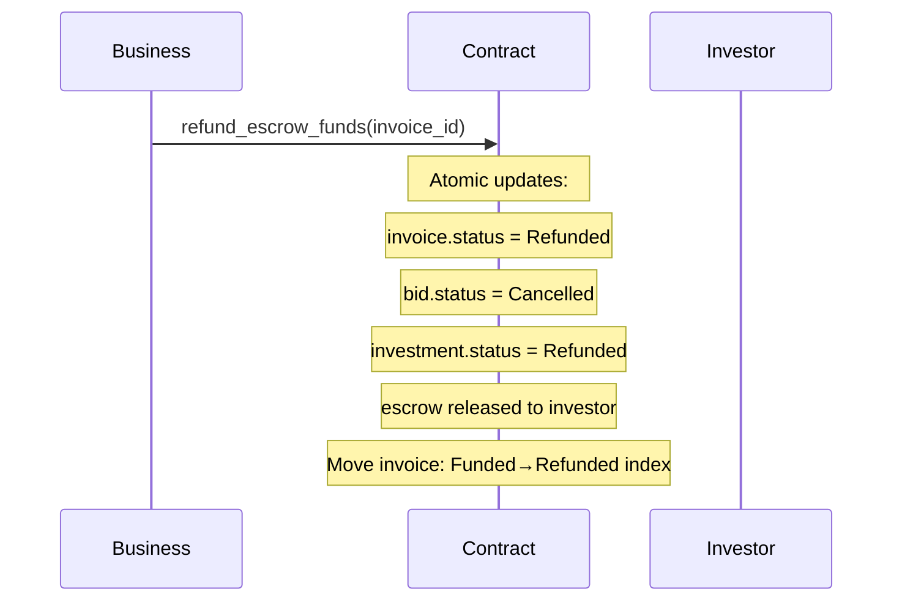
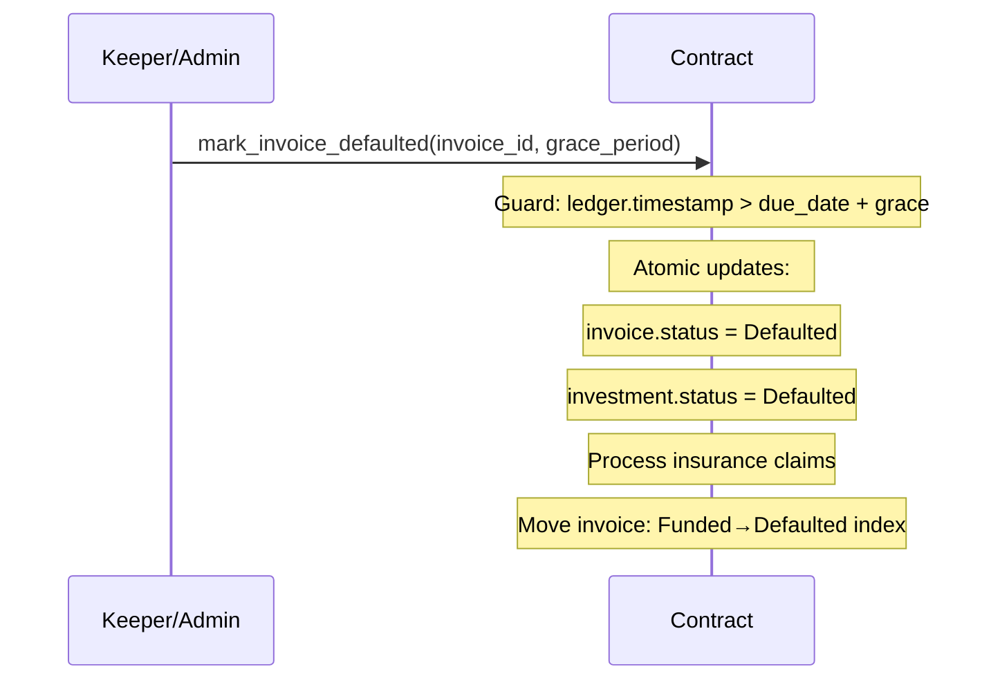
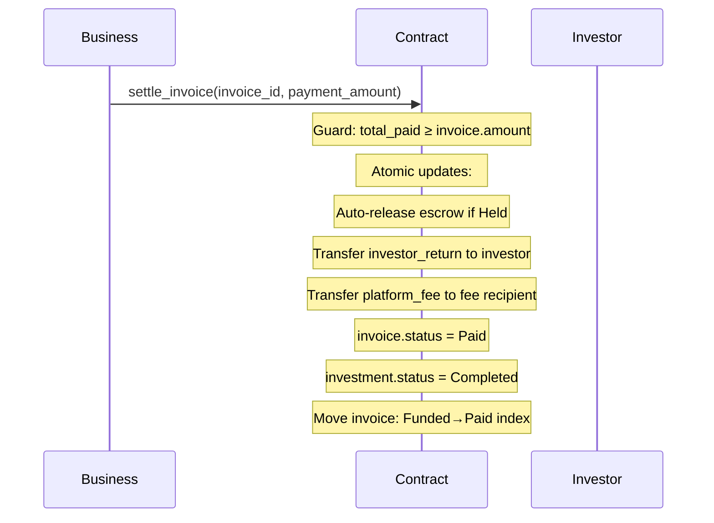

# QuickLendX Invoice Lifecycle & Cross-Module Consistency

> **Version**: 1.0 — April 2026
> **Related issue**: [#789](https://github.com/QuickLendX/quicklendx-protocol/issues/789)

## Overview

This document defines the full invoice lifecycle state machine, the cross-module
invariants that must hold after every transition, and the regression test suite
that enforces them.

---

## 1. State Machine

### 1.1 Invoice Status

```
Pending ──▶ Verified ──▶ Funded ──▶ Paid
                            │
                            ├──▶ Defaulted
                            └──▶ Refunded
Pending ──▶ Cancelled
```

| Status     | Terminal? | Trigger                          |
|------------|-----------|----------------------------------|
| `Pending`  | No        | `store_invoice` / `upload_invoice` |
| `Verified` | No        | `verify_invoice`                 |
| `Funded`   | No        | `accept_bid` / `accept_bid_and_fund` |
| `Paid`     | **Yes**   | `settle_invoice`                 |
| `Defaulted`| **Yes**   | `mark_invoice_defaulted`         |
| `Refunded` | **Yes**   | `refund_escrow_funds`            |
| `Cancelled`| **Yes**   | Manual cancellation              |

### 1.2 Bid Status

```
Placed ──▶ Accepted
  │
  ├──▶ Withdrawn
  ├──▶ Expired
  └──▶ Cancelled
```

### 1.3 Investment Status

```
Active ──▶ Completed   (on settle)
  │
  ├──▶ Defaulted       (on invoice default)
  ├──▶ Refunded        (on escrow refund)
  └──▶ Withdrawn       (on investor withdrawal)
```

### 1.4 Escrow Status

```
Held ──▶ Released      (on settle / release_escrow)
  │
  └──▶ Refunded        (on refund_escrow_funds)
```

---

## 2. Cross-Module Invariants

These invariants **must** hold after every lifecycle transition. Violation of any
invariant indicates a bug that could be exploited for value extraction.

### INV-1: Status Alignment

| Invoice Status | Required Bid Status | Required Investment Status | Escrow      |
|----------------|--------------------|-----------------------------|-------------|
| `Funded`       | `Accepted`         | `Active`                    | `Held`      |
| `Paid`         | `Accepted`         | `Completed`                 | `Released`  |
| `Defaulted`    | `Accepted`         | `Defaulted`                 | N/A†        |
| `Refunded`     | `Cancelled`        | `Refunded`                  | `Refunded`  |

† Escrow may have been auto-released during settlement; the important invariant is
that no `Held` escrow exists for a `Defaulted` invoice.

### INV-2: No Orphan Pointers

- Every `investment.invoice_id` must reference an existing invoice.
- Every `invoice.investor` (when `Some`) must match `investment.investor`.
- Every escrow record's `invoice_id` must reference an existing invoice.
- `get_invoices_by_status(S)` must contain **only** invoices whose canonical
  `status == S`.

### INV-3: Count Conservation

```
total_invoice_count == Σ get_invoice_count_by_status(S) for all S ∈ InvoiceStatus
```

No invoice may exist outside every status bucket (orphan) or inside multiple
buckets simultaneously.

### INV-4: Index Membership

After a status transition from `A → B`:
- The invoice **must** be removed from the `A` status index.
- The invoice **must** be added to the `B` status index.
- The invoice **must not** appear in any other status index.

### INV-5: Funded-Amount Agreement

When `invoice.status == Funded`:
```
invoice.funded_amount == bid.bid_amount == investment.amount == escrow.amount
```

### INV-6: Terminal State Immutability

Once an invoice reaches a terminal status (`Paid`, `Defaulted`, `Refunded`,
`Cancelled`), no further status transition is allowed. Attempts must be rejected
with `InvalidStatus` or a domain-specific error.

---

## 3. Lifecycle Flows

### 3.1 Accept Flow (Verified → Funded)



**Post-conditions verified by `test_accept_bid_cross_module_consistency`:**
- Invoice: `status=Funded`, `funded_amount=bid_amount`, `investor=Some(investor)`
- Bid: `status=Accepted`
- Investment: `status=Active`, `invoice_id` matches, `amount=bid_amount`
- Escrow: exists, `amount=bid_amount`
- Index: in `Funded`, not in `Verified`

### 3.2 Refund Flow (Funded → Refunded)



**Post-conditions verified by `test_refund_escrow_cross_module_consistency`:**
- Invoice: `status=Refunded`
- Bid: `status=Cancelled` (no orphan Accepted bid)
- Investment: `status=Refunded` (no orphan Active investment)
- Escrow: released
- Index: in `Refunded`, not in `Funded`

### 3.3 Default Flow (Funded → Defaulted)



**Post-conditions verified by `test_default_cross_module_consistency`:**
- Invoice: `status=Defaulted`
- Investment: `status=Defaulted` (no ghost Active investment)
- Index: in `Defaulted`, not in `Funded`

### 3.4 Settlement Flow (Funded → Paid)



**Post-conditions verified by `test_finalize_settle_cross_module_consistency`:**
- Invoice: `status=Paid`, `total_paid=amount`, `settled_at` set
- Investment: `status=Completed` (no Active investment on a Paid invoice)
- Index: in `Paid`, not in `Funded`

---

## 4. Security Considerations

### 4.1 Exploitable Inconsistencies

| Inconsistency | Exploit Vector |
|---------------|----------------|
| Active investment on Paid invoice | Double-settlement or re-claiming returns |
| Held escrow on Defaulted invoice | Unauthorized escrow release after default |
| Invoice in Funded index after Refund | Re-bidding on a refunded invoice |
| Orphan bid (Accepted, no investment) | Phantom bid blocking new bids |
| Stale status index membership | Off-chain clients making wrong funding decisions |

### 4.2 Mitigation

All invariants from §2 are enforced by the regression suite in
`test_cross_module_consistency.rs`. The tests are designed to catch regressions
introduced by future refactors that modify transaction atomicity boundaries.

---

## 5. Test Coverage Matrix

| Test | INV-1 | INV-2 | INV-3 | INV-4 | INV-5 | INV-6 |
|------|:-----:|:-----:|:-----:|:-----:|:-----:|:-----:|
| `test_accept_bid_cross_module_consistency` | ✅ | ✅ | ✅ | ✅ | ✅ | — |
| `test_refund_escrow_cross_module_consistency` | ✅ | ✅ | ✅ | ✅ | — | — |
| `test_default_cross_module_consistency` | ✅ | ✅ | ✅ | ✅ | — | — |
| `test_finalize_settle_cross_module_consistency` | ✅ | ✅ | ✅ | ✅ | — | — |
| `test_no_orphan_after_sequential_operations` | ✅ | ✅ | ✅ | ✅ | — | — |
| `test_query_canonical_record_agreement` | — | ✅ | ✅ | ✅ | — | — |

---

## 6. Running the Tests

```bash
# Run only cross-module consistency tests
cd quicklendx-contracts
cargo test test_cross_module

# Run all lifecycle-related tests
cargo test test_lifecycle test_cross_module test_investment_lifecycle
```
