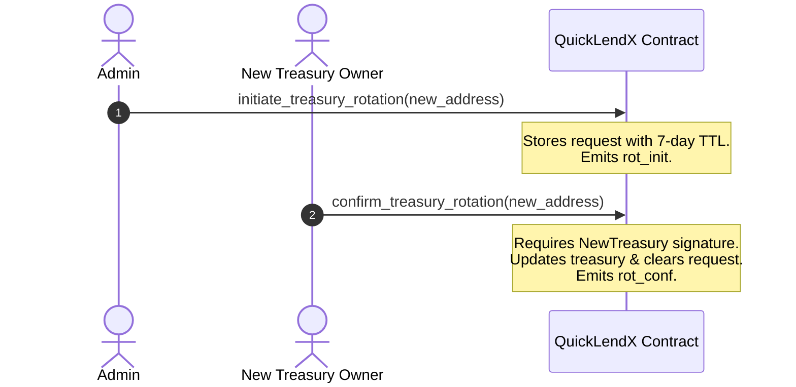

# Platform Fee & Treasury Split Operations Guide

This guide is designed for **Platform Operators** (Administrators) responsible for managing the platform fee rates, treasury routing, address rotation, and revenue distribution splits on-chain.

---

## 1. Platform Fee Management

The platform fee is a percentage fee charged on invoice profits during settlement. It is stored on-chain inside the `PlatformFeeConfig` structure and can be updated dynamically by the administrator.

### Parameters & Constraints
*   **Default Fee Rate**: 2.0% (`200` basis points).
*   **Maximum Fee Rate**: 10.0% (`1000` basis points) hard-capped at the contract level.
*   **Decimals**: Denominated in basis points (BPS), where `10,000 BPS = 100%`. E.g., `500 BPS = 5%`.
*   **Validation Rules**:
    *   Any update attempting to exceed the `1000 BPS` cap returns `InvalidFeeBasisPoints` (Contract Error `105`).
    *   Setting a fee rate identical to the currently stored fee rate results in a "no-op" (returns success immediately without writing to storage or emitting events).
*   **Events Emitted**: `platform_fee_config_updated` (topic: `fee_cfg`) containing the `old_fee_bps`, `new_fee_bps`, and `admin` address.

### Updating the Platform Fee Rate
To update the platform fee rate, invoke the `update_platform_fee_bps` entrypoint.

```bash
stellar contract invoke \
  --id <CONTRACT_ID> \
  --source <ADMIN_ACCOUNT> \
  --network <NETWORK> \
  -- update_platform_fee_bps \
  --new_fee_bps 500
```
*(Sets the platform fee to 5.0% / 500 BPS)*

---

## 2. Treasury Configuration & Address Rotation

To avoid locking up collected fees or routing them to an unowned address, the treasury configuration enforces strict security checks, including a **two-step confirmation flow** for rotations.

### Initial Configuration
Upon deployment or initialization of the fee system, configure the primary treasury address using `configure_treasury`.

```bash
stellar contract invoke \
  --id <CONTRACT_ID> \
  --source <ADMIN_ACCOUNT> \
  --network <NETWORK> \
  -- configure_treasury \
  --treasury_address <INITIAL_TREASURY_ADDRESS>
```

#### Constraints:
*   The treasury address **cannot** be the contract's own address (`InvalidAddress`).
*   The treasury address **cannot** match the currently configured treasury address (`InvalidFeeConfiguration`).
*   Emits `treasury_configured` (topic: `trs_cfg`) event.

### Two-Step Treasury Address Rotation
To update or rotate an active treasury address, the admin must coordinate with the new treasury recipient to complete the two-step rotation process. This prevents irreversible loss of funds in case of typos or using addresses without working keys.



#### Step 1: Initiate Rotation (Admin Only)
The administrator initiates the rotation, specifying the new treasury address.

```bash
stellar contract invoke \
  --id <CONTRACT_ID> \
  --source <ADMIN_ACCOUNT> \
  --network <NETWORK> \
  -- initiate_treasury_rotation \
  --new_address <NEW_TREASURY_ADDRESS>
```
*   **Result**: Stores a pending `RecipientRotationRequest` on-chain with a **7-day timelock/deadline** (`604,800` seconds).
*   **Validation**: Rejects if another rotation is already pending (`RotationAlreadyPending` / error `1853`) or if the proposed address matches the current treasury (`InvalidAddress`).
*   **Events**: Emits `rot_init`.

#### Step 2: Confirm Rotation (New Treasury Only)
The **new treasury account itself** must sign and execute this transaction to confirm. This serves as a cryptographic proof of ownership.

```bash
stellar contract invoke \
  --id <CONTRACT_ID> \
  --source <NEW_TREASURY_ACCOUNT> \
  --network <NETWORK> \
  -- confirm_treasury_rotation \
  --new_address <NEW_TREASURY_ADDRESS>
```
*   **Validation**:
    *   Rejects if called by an address other than the pending `new_address` (`Unauthorized`).
    *   Rejects if called after the 7-day timelock has expired (`RotationExpired` / error `1855`). If expired, the pending state is automatically cleared.
*   **Result**: Commits the change, updating the platform configuration and clearing the pending request.
*   **Events**: Emits `rot_conf`.

#### Cancelling a Rotation (Admin Only)
The administrator can abort a pending rotation at any time prior to confirmation.

```bash
stellar contract invoke \
  --id <CONTRACT_ID> \
  --source <ADMIN_ACCOUNT> \
  --network <NETWORK> \
  -- cancel_treasury_rotation
```
*   **Result**: Clears the pending rotation. Emits `rot_canc`.

---

## 3. Revenue Distribution Split

Collected platform fees can be split among three on-chain targets: the **Treasury**, the **Developer Fund**, and the **Platform Reserves**.

### Share Configuration
Configure the splits using the `configure_revenue_distribution` entrypoint.

```bash
stellar contract invoke \
  --id <CONTRACT_ID> \
  --source <ADMIN_ACCOUNT> \
  --network <NETWORK> \
  -- configure_revenue_distribution \
  --treasury_address <TREASURY_ADDRESS> \
  --treasury_share_bps 6000 \
  --developer_share_bps 2000 \
  --platform_share_bps 2000 \
  --auto_distribution false \
  --min_distribution_amount 1000000000
```
*(Configures a 60% Treasury, 20% Developer, 20% Platform split with a 100 XLM / 1B Stroops threshold)*

#### Configuration Constraints:
*   **BPS Scaling**: Shares are in basis points where `10,000 BPS = 100%`.
*   **Sum Constraint**: The sum of `treasury_share_bps + developer_share_bps + platform_share_bps` must equal exactly `10,000` (`100%`). Otherwise, returns `InvalidAmount` (error `103`).
*   **Individual Bounds**: No single share can exceed `10,000` (`InvalidFeeConfiguration`).
*   **Treasury Address Consistency**: If platform fee routing is configured (via `configure_treasury`) and `treasury_share_bps > 0`, the `treasury_address` specified in the split **must** match the configured platform fee treasury. Otherwise, operations fail with `InvalidFeeConfiguration` during distribution.
*   **Minimum Distribution Threshold**: `min_distribution_amount` must be non-negative (`>= 0`).

### Triggering Distribution
If `auto_distribution` is disabled, an operator must manually trigger the payout of accumulated fee revenue for a given period using `distribute_revenue`.

```bash
stellar contract invoke \
  --id <CONTRACT_ID> \
  --source <ADMIN_ACCOUNT> \
  --network <NETWORK> \
  -- distribute_revenue \
  --admin <ADMIN_ADDRESS> \
  --period <PERIOD_ID>
```
*   **Period Calculation**: Period IDs are calculated as `ledger_timestamp / 2,592,000` (roughly a 30-day epoch).
*   **Rounding Remainder**: Rounding dust is automatically added to the Platform share to ensure `Treasury + Developer + Platform == PendingAmount` exactly, preventing locked dust.
*   **Idempotency Protection**: If `pending_distribution == 0` for the target period, the call returns `OperationNotAllowed` (`OP_NA`) to prevent duplicate payouts or zero-amount events.

---

## Related Documentation

*   [Platform Fee System Overview](./fees.md)
*   [Revenue Split Architecture](./revenue-split.md)
*   [Access Control Matrix](./access-control.md)
