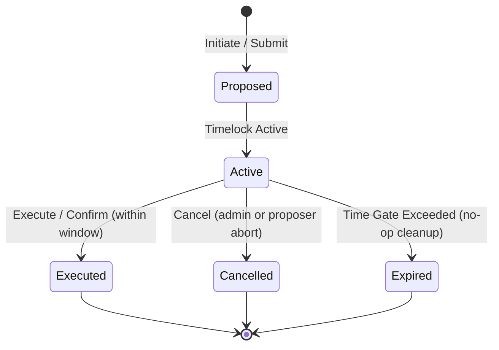

# Timelocked and Queued Operations Lifecycle

Audience: **contributors** working on the QuickLendX smart contract codebase.

To protect critical protocol state and funds from compromise or operational mistakes, QuickLendX enforces a **Proposal → Queue → Execute → Cancel** lifecycle pattern using time gates (timelocks and expirations). Instead of executing highly privileged or structural changes instantly, they must first be queued on-chain. This provides observers and governance with a cooling-off window to audit the proposed action, and allows authorization targets to be validated before control transitions.

Three primary subsystems implement this pattern in the QuickLendX contracts:
1. **Emergency Withdraw / Recovery** (`src/emergency.rs`): A last-resort recovery mechanism for stuck non-escrow tokens.
2. **Treasury Rotation** (`src/fees.rs`): A two-step rotation process for the platform fee recipient address.
3. **Governance Proposals** (`src/governance.rs`): Pluggable trait for module-level voting and proposal execution.

---

## State Transitions Diagram



---

## 1. Emergency Withdraw / Recovery

Emergency withdrawal allows the admin to recover stuck tokens. It guards against instant drainage via a mandatory delay and explicitly protects same-token held escrow reserves.

### Lifecycle States
- **Proposed / Queued**: Calling `initiate_emergency_withdraw` creates a single pending slot record containing the target, amount, token, unlock timestamp, and expiration timestamp.
- **Lock Gate (Timelock)**: The withdrawal is locked until `unlock_at`. `execute_emergency_withdraw` rejects with `EmergencyWithdrawTimelockNotElapsed` if called early.
- **Execution Window**: The proposal can be executed once `now >= unlock_at` and before `expires_at`.
- **Cancellation**: The admin can call `cancel_emergency_withdraw` at any time before execution. This marks the request as cancelled on-chain and permanently burns its unique nonce to prevent replay.

### Data Structure & Storage Layout
Defined in `src/emergency.rs`:
```rust
#[contracttype]
#[derive(Clone, Eq, PartialEq)]
pub struct PendingEmergencyWithdrawal {
    pub token: Address,
    pub amount: i128,
    pub target: Address,
    pub unlock_at: u64,       // Timestamp after which execution is allowed
    pub expires_at: u64,      // Timestamp after which the proposal expires
    pub initiated_at: u64,
    pub initiated_by: Address,
    pub nonce: u64,           // Monotonically increasing ID preventing replay
    pub cancelled: bool,
    pub cancelled_at: u64,
}
```

### Entrypoint Signatures (from `src/lib.rs` / `src/emergency.rs`)

#### Initiate (Queue)
```rust
pub fn initiate_emergency_withdraw(
    env: Env,
    admin: Address,
    token: Address,
    amount: i128,
    target: Address,
) -> Result<(), QuickLendXError>;
```
- **Time Gates**:
  - `unlock_at = env.ledger().timestamp() + 24 hours` (`DEFAULT_EMERGENCY_TIMELOCK_SECS`)
  - `expires_at = unlock_at + 7 days` (`DEFAULT_EMERGENCY_EXPIRATION_SECS`)

#### Execute
```rust
pub fn execute_emergency_withdraw(env: Env, admin: Address) -> Result<(), QuickLendXError>;
```
- **Constraints**:
  - Requires `now >= unlock_at` and `now < expires_at`.
  - Verifies same-token escrow reserves are fully checked and protected.

#### Cancel
```rust
pub fn cancel_emergency_withdraw(env: Env, admin: Address) -> Result<(), QuickLendXError>;
```

### Event Emissions
- `emg_init`: `(symbol_short!("emg_init"), token, amount, target, unlock_at, admin)`
- `emg_exec`: `(symbol_short!("emg_exec"), token, amount, target, admin)`
- `emg_cncl`: `(symbol_short!("emg_cncl"), token, amount, target, admin)`

---

## 2. Treasury / Platform Fee Recipient Rotation

Treasury rotation updates the destination address for platform fees. To prevent sending fees to an uncontrolled or typo-entered address, the new address must actively authorize the rotation to confirm it.

### Lifecycle States
- **Proposed / Queued**: Calling `set_treasury` initiates a rotation request and stores a `RecipientRotationRequest` in instance storage.
- **Lock Gate (Timelock)**: The request cannot be confirmed until 1 day (`MIN_ROTATION_DELAY_SECONDS`) has passed.
- **Execution Window**: The proposed `new_address` must call `confirm_treasury_rotation` before the 7-day deadline (`ROTATION_TTL_SECONDS`) expires.
- **Cancellation**: The admin can call `cancel_treasury_rotation` to abort the pending transition.

### Data Structure & Storage Layout
Defined in `src/fees.rs`:
```rust
#[contracttype]
#[derive(Clone, Debug, Eq, PartialEq)]
pub struct RecipientRotationRequest {
    pub new_address: Address,
    pub initiated_by: Address,
    pub initiated_at: u64,
    pub confirmation_deadline: u64,
}
```

### Entrypoint Signatures (from `src/lib.rs` / `src/fees.rs`)

#### Initiate (Queue)
```rust
pub fn set_treasury(
    env: Env,
    admin: Address,
    treasury: Address,
) -> Result<RecipientRotationRequest, QuickLendXError>;
```
- **Time Gates**:
  - `confirmation_deadline = env.ledger().timestamp() + 7 days`

#### Confirm (Execute)
```rust
pub fn confirm_treasury_rotation(
    env: Env,
    new_address: Address,
) -> Result<Address, QuickLendXError>;
```
- **Constraints**:
  - Caller must match `new_address` (verifies key control).
  - Requires `now >= initiated_at + 1 day` (`MIN_ROTATION_DELAY_SECONDS`).
  - Requires `now <= confirmation_deadline`.

#### Cancel
```rust
pub fn cancel_treasury_rotation(env: Env, admin: Address) -> Result<(), QuickLendXError>;
```

### Event Emissions
- `tr_rot_cn`: `(symbol_short!("tr_rot_cn"), admin)`

---

## 3. Governance Proposals (`Governable` Trait)

The `Governable` trait defines a generic voting and execution flow for smart contract modules. Time gates here are measured in **ledger sequence deltas** rather than timestamps.

### Lifecycle States
- **Active**: open for voting. Created via `submit_proposal`.
- **Passed / Rejected**: Auto-calculated during finalization when the ledger sequence passes `voting_ends_at_ledger`. Requires quorum and a majority of positive votes.
- **Executed**: A passed proposal is executed on-chain via `run_proposal`.
- **Cancelled**: Marked as cancelled by the proposer or admin prior to execution.

### Data Structure & Storage Layout
Defined in `src/governance.rs`:
```rust
#[contracttype]
#[derive(Clone, Copy, Debug, Eq, PartialEq)]
pub enum ProposalStatus {
    Active,
    Passed,
    Rejected,
    Executed,
    Cancelled,
}

#[contracttype]
#[derive(Clone, Debug)]
pub struct Proposal {
    pub id: BytesN<32>,
    pub proposer: Address,
    pub votes_for: u64,
    pub votes_against: u64,
    pub voting_ends_at_ledger: u32, // Ledger sequence time gate
    pub status: ProposalStatus,
}
```

### Trait Entrypoint Signatures (from `src/governance.rs`)

#### Submit (Queue)
```rust
fn submit_proposal(
    env: &Env,
    proposer: &Address,
    proposal_id: BytesN<32>,
) -> Result<Proposal, QuickLendXError>;
```
- **Time Gates**:
  - `voting_ends_at_ledger = env.ledger().sequence() + voting_period_ledgers()`

#### Cast Vote
```rust
fn cast_vote(
    env: &Env,
    voter: &Address,
    proposal_id: &BytesN<32>,
    in_favour: bool,
) -> Result<(), QuickLendXError>;
```
- **Constraints**:
  - Rejects if `env.ledger().sequence() > voting_ends_at_ledger`.

#### Run (Execute)
```rust
fn run_proposal(env: &Env, proposal_id: &BytesN<32>) -> Result<(), QuickLendXError>;
```
- **Constraints**:
  - Finalizes the proposal status if the voting period has closed.
  - Requires `Passed` status to delegate to the implementor's `execute_proposal` method.

---

## Time Gate Parameters Summary

| Subsystem | Proposal/Queue | Lock Gate (Min Delay) | Expiration Gate (Deadline) | Execute / Confirm | Cancel |
| :--- | :--- | :--- | :--- | :--- | :--- |
| **Emergency Recovery** | `initiate_emergency_withdraw` | `unlock_at` (now + 24h) | `expires_at` (unlock_at + 7d) | `execute_emergency_withdraw` (Admin) | `cancel_emergency_withdraw` (Admin) |
| **Treasury Rotation** | `set_treasury` | `initiated_at + 1 day` | `confirmation_deadline` (initiated_at + 7d) | `confirm_treasury_rotation` (New Treasury Address) | `cancel_treasury_rotation` (Admin) |
| **Governance** | `submit_proposal` | N/A (voting open) | `voting_ends_at_ledger` (sequence delta) | `run_proposal` (Anyone, after voting closes) | Proposer / Admin |
