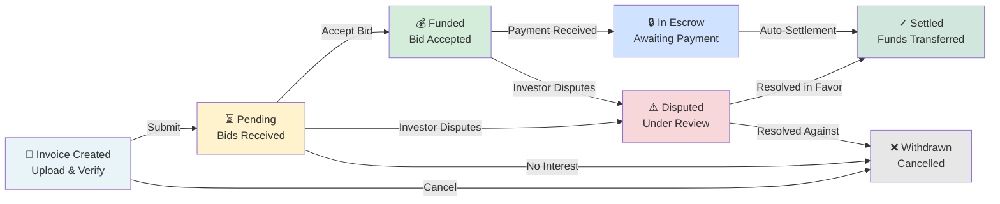

# Business Dashboard UX Specification

**Version**: 1.0  
**Status**: Active  
**Last Updated**: 2026-04-28  
**Document Owner**: Product & Design Team  

---

## Table of Contents

1. [Overview](#overview)
2. [User Research & Personas](#user-research--personas)
3. [Goals & Success Metrics](#goals--success-metrics)
4. [Dashboard Layout](#dashboard-layout)
5. [Core Sections](#core-sections)
6. [Component Specifications](#component-specifications)
7. [Data Display Patterns](#data-display-patterns)
8. [Interactive Flows](#interactive-flows)
9. [Security & Privacy](#security--privacy)
10. [Responsive Design](#responsive-design)
11. [Accessibility](#accessibility)
12. [Error Handling & Empty States](#error-handling--empty-states)
13. [Performance Considerations](#performance-considerations)
14. [Review Notes & Decisions](#review-notes--decisions)

---

## Overview

### Purpose

The Business Dashboard is the primary control center for businesses using QuickLendX. It provides a consolidated view of:
- **Invoice Pipeline**: Status of all invoices through the lifecycle
- **Funding Progress**: Real-time visualization of funding progression
- **Settlement History**: Records of completed transactions and payouts
- **Alerts & Risks**: Dispute notifications, defaults, and action items
- **Next Actions**: Prioritized tasks for the business to complete

### Target User

**Business Owners / Finance Managers** who:
- Upload and manage invoices (1-100+ per month)
- Need to track funding progress in real-time
- Require transparency on fees, settlements, and payout schedules
- Must manage disputes and handle defaults
- Want to understand platform economics (ROI, time-to-fund, rates)

### Key Principles

1. **Clarity**: Information hierarchy is clear; no jargon without explanation
2. **Transparency**: All costs, timelines, and risks are visible upfront
3. **Actionability**: Every section suggests a clear next step
4. **Security**: No PII in unexpected places; clear data-sharing visuals
5. **Accessibility**: WCAG 2.1 AA compliance; keyboard navigation throughout
6. **Efficiency**: Expert users can scan key metrics in <5 seconds

---

## User Research & Personas

### Primary Persona: Maya (Finance Manager, SMB)

- **Company**: Logistics startup, $2M revenue
- **Monthly Invoice Volume**: 15-40 invoices
- **Pain Points**:
  - Needs to explain funding delays to management
  - Wants to optimize invoice structuring for faster funding
  - Concerned about disputes and payment defaults
  - Limited time (checks dashboard 1-2x per day)
- **Goals**:
  - Know cash position instantly
  - Identify problem invoices quickly
  - Understand fee structures
  - Plan cash flow with settlement dates

### Secondary Persona: Raj (CFO, Enterprise)

- **Company**: Manufacturing, $50M+ revenue
- **Monthly Invoice Volume**: 200-500+ invoices
- **Pain Points**:
  - Requires detailed reporting for audits
  - Multiple team members need access with role-based views
  - Needs API integration with accounting software
  - Complex dispute workflows
- **Goals**:
  - Aggregate metrics across all invoices
  - Detailed historical analysis
  - Audit trails and compliance records
  - Bulk operations and exports

### Edge Case: Ahmed (Dispute Resolver)

- **Role**: Handles disputes and defaults
- **Monthly Interactions**: 1-5 disputes per business
- **Pain Points**:
  - Needs quick access to disputed invoice details
  - Must communicate clearly with investors about issues
  - Needs to track dispute resolution status
- **Goals**:
  - Find disputed invoices instantly
  - See communication history
  - Update dispute status with clear rationale
  - Schedule follow-ups

---

## Goals & Success Metrics

### Business Goals

1. **Adoption**: >85% of active businesses use dashboard at least weekly
2. **Engagement**: Average session duration >3 minutes; return visits >5x/week
3. **Support Reduction**: 30% fewer support tickets about "where's my money?"
4. **Dispute Prevention**: Clear visibility prevents 15%+ of disputes
5. **Retention**: Dashboard usage correlates with 2x lower churn

### User Experience Goals

1. **Time to First Insight**: Key metrics visible in <2 seconds
2. **Error Recovery**: Users can identify and fix problems without support
3. **Confidence**: Users understand what's happening at every step
4. **Satisfaction**: NPS >50 for dashboard users
5. **Accessibility**: 100% keyboard navigable; 0 accessibility issues in WCAG 2.1 AA

---

## Dashboard Layout

### High-Level Structure

```
┌─────────────────────────────────────────────────────────────┐
│  QuickLendX Dashboard                    [Notifications] [Profile]
├─────────────────────────────────────────────────────────────┤
│
│  ┌─ SECTION 1: AT-A-GLANCE METRICS ────────────────────┐
│  │  [Total Invoices]  [Funded Amount]  [Pending Funding] │
│  │  [Expected Payout]  [Avg Time-to-Fund]  [Disputes]   │
│  └──────────────────────────────────────────────────────┘
│
│  ┌─ SECTION 2: ALERTS & NEXT ACTIONS ──────────────────┐
│  │  [⚠️ Action Required: Invoice #123 Disputed]         │
│  │  [⚠️ Invoice Overdue for 2 Days]                     │
│  │  [✓ 3 Invoices Ready for Settlement]               │
│  └──────────────────────────────────────────────────────┘
│
│  ┌─ SECTION 3: INVOICE PIPELINE ───────────────────────┐
│  │  Created (5) → Pending (8) → Funded (12) → Settled (3)│
│  │  │                                         Disputed (1)│
│  │  └─ Each status shows invoice count + action buttons
│  └──────────────────────────────────────────────────────┘
│
│  ┌─ SECTION 4: FUNDING PROGRESS (Top 5 Active) ────────┐
│  │  Invoice #101 | Amount: $5,000 | Progress: 80% ■■■□ │
│  │  Invoice #102 | Amount: $3,500 | Progress: 30% ■□□□ │
│  │  Invoice #103 | Amount: $8,200 | Progress: 0% □□□□  │
│  │  Invoice #104 | Amount: $2,100 | Progress: 100% ■■■ │
│  │  Invoice #105 | Amount: $6,750 | Progress: 50% ■■□□ │
│  └──────────────────────────────────────────────────────┘
│
│  ┌─ SECTION 5: SETTLEMENT RECEIPTS ────────────────────┐
│  │  Date | Invoice # | Amount | Fees | Net Payout | Ref #
│  │  ──────────────────────────────────────────────────── │
│  │  4/28 | INV-8201  | $5,000 | $150 | $4,850    | [Download]
│  │  4/27 | INV-8200  | $3,500 | $105 | $3,395    | [Download]
│  │  4/26 | INV-8199  | $8,200 | $246 | $7,954    | [Download]
│  │  [Show More...]                                  [Export]
│  └──────────────────────────────────────────────────────┘
│
│  ┌─ SECTION 6: DISPUTES & DEFAULTS ────────────────────┐
│  │  [Filter] [Sort by Date] [Status]                    │
│  │  ┌─────────────────────────────────────────────────┐ │
│  │  │ Invoice: INV-8150 | Status: Under Review      │ │
│  │  │ Amount: $5,000 | Reason: Quality Dispute      │ │
│  │  │ Filed: 4/26 2:30 PM | Last Update: 4/28 9 AM │ │
│  │  │ [View Details] [Add Comment] [Respond]        │ │
│  │  └─────────────────────────────────────────────────┘ │
│  │  [No Active Disputes]                                │
│  └──────────────────────────────────────────────────────┘
│
└─────────────────────────────────────────────────────────────┘
```

### Visual Hierarchy

| Priority | Content | Placement | Rationale |
|----------|---------|-----------|-----------|
| 1 | At-a-Glance Metrics | Top, 4-6 KPIs | Users need instant cash position |
| 2 | Alerts & Actions | Below metrics, max 3 items | Time-sensitive items visible |
| 3 | Pipeline Status | Central fold | Shows distribution, directs to details |
| 4 | Funding Progress | Mid-page | User's primary concern (when will I get paid?) |
| 5 | Settlement History | Lower fold | Reference data, less urgent |
| 6 | Disputes | Bottom, collapsible | Most users have no disputes; some need quick access |

---

## Core Sections

### Section 1: At-a-Glance Metrics

**Purpose**: Answer the question "What's my cash status right now?" in <2 seconds.

#### Metric Cards (6 Cards, Responsive Grid)

```
┌─────────────────────┐  ┌─────────────────────┐  ┌─────────────────────┐
│ TOTAL INVOICES      │  │ TOTAL FUNDED        │  │ PENDING FUNDING     │
│ 156                 │  │ $87,500             │  │ $42,300 (42%)      │
│ ↑ 12 from last week │  │ ↓ $5,200 vs last mo │  │ 8 invoices          │
│ [View All]          │  │ [Breakdown]         │  │ [View Pipeline]     │
└─────────────────────┘  └─────────────────────┘  └─────────────────────┘

┌─────────────────────┐  ┌─────────────────────┐  ┌─────────────────────┐
│ EXPECTED PAYOUT     │  │ AVG TIME-TO-FUND    │  │ ACTIVE DISPUTES     │
│ $82,950 (fees deducted) │ 4.2 days          │  │ 1 (2% of invoices)  │
│ Due: Next 14 days   │  │ Target: 3 days     │  │ ⚠️ Requires action │
│ [View Schedule]     │  │ [See Trend]        │  │ [View Details]      │
└─────────────────────┘  └─────────────────────┘  └─────────────────────┘
```

#### Metric Details

| Metric | Formula | Updates | Context | 
|--------|---------|---------|---------|
| **Total Invoices** | Count of all invoices | Real-time | Trend (↑/↓ vs last week) |
| **Total Funded** | Sum of `invoice.funded_amount` | Real-time | $ vs % of targets |
| **Pending Funding** | Sum of unfunded invoices | Real-time | Shows urgency |
| **Expected Payout** | `sum(funded_amount × (1 - fees))` | Real-time | **Critical**: Shows net cash, not gross |
| **Avg Time-to-Fund** | Median days from upload to full funding | Daily | Trend line over time |
| **Active Disputes** | Count of disputed invoices | Real-time | Risk indicator |

**Security Considerations**:
- ✅ Show "Total Funded" (gross), NOT investor names or exact bid amounts
- ✅ "Expected Payout" must include fee deductions upfront (transparency)
- ✅ Do not show investor details unless there's explicit data-sharing agreement
- ✅ Disputes should never expose reasons that identify invoice contents

**Interactive Elements**:
- Click card → Drill down to detailed view
- Hover metric → Tooltip with calculation formula
- Click trend arrow → Show historical chart

---

### Section 2: Alerts & Next Actions

**Purpose**: Surface time-sensitive items requiring immediate attention.

#### Alert Structure

```
┌─────────────────────────────────────────────────────────────────────┐
│ ALERTS & NEXT ACTIONS (Dismissible, sorted by priority)             │
├─────────────────────────────────────────────────────────────────────┤
│
│ [🔴 URGENT] Invoice INV-8150 Disputed | Amount: $5,000             │
│ Filed by investor 2 days ago. Reason: Quality concern.              │
│ → [View & Respond] [Dismiss Until Resolved]                         │
│
│ [🟠 WARNING] Invoice INV-8149 Overdue for 2 Days | Amount: $3,500   │
│ Expected settlement on 4/26; not yet settled. Contact support?      │
│ → [View Invoice] [Mark as Resolved]                                 │
│
│ [🟡 INFO] 3 Invoices Ready for Settlement | Total: $12,750          │
│ These will be settled within 24 hours.                              │
│ → [View Details] [Download Receipt]                                 │
│
│ [✓ SUCCESS] Invoice INV-8145 Fully Funded | Amount: $8,200          │
│ Invoices move to settlement phase automatically.                    │
│ → [View Settlement Plan]                                            │
│
└─────────────────────────────────────────────────────────────────────┘
```

#### Alert Types & Priority

| Type | Color | Trigger | Action | Auto-Resolve |
|------|-------|---------|--------|--------------|
| **Dispute** | 🔴 Red | Investor files dispute | Respond to dispute | Manual |
| **Overdue** | 🟠 Orange | Settlement delayed >24h | Contact support | Auto (when settled) |
| **Action** | 🟡 Yellow | Invoices in pending state | View & manage | Auto (state change) |
| **Success** | ✓ Green | Invoice milestone reached | Review & next step | Manual (dismiss) |

**Behavior Rules**:
- Max 5 alerts visible; older items grouped as "2 more alerts"
- High-priority (Dispute, Overdue) always shown first
- Users can dismiss alerts; dismissed alerts reappear if state changes
- Alerts auto-resolve when underlying condition changes

**Security Considerations**:
- ✅ Never expose dispute details (reason, investor name) in alert preview
- ✅ Link to full detail page requires authentication
- ✅ Dismissing alert does NOT change underlying issue; just hides UI
- ✅ Overdue alerts do NOT guarantee support resolution; honest messaging

---

### Section 3: Invoice Pipeline

**Purpose**: Show distribution of invoices across lifecycle statuses at a glance.

#### Pipeline Visualization

```
┌──────────────────────────────────────────────────────────────────┐
│ INVOICE PIPELINE                                                 │
├──────────────────────────────────────────────────────────────────┤
│
│  Created      Pending      Funded       Settled      Disputed
│  ┌────┐      ┌────┐      ┌────┐      ┌────┐      ┌────┐
│  │ 5  │  →   │ 8  │  →   │ 12 │  →   │ 127│  ✗   │ 1  │
│  │    │      │    │      │    │      │    │      │    │
│  └────┘      └────┘      └────┘      └────┘      └────┘
│  Invoices    Bids being  Funded &    Settled or  Invoice
│  awaiting    evaluated   in progress paid out    disputed
│  first bid   or funded   (escrow)                /defaulted
│
│  Total: 156 invoices | Healthy flow → | ⚠️ Review disputes
│
│  [↓ Show Historical Trend] [View Status Details]
│
└──────────────────────────────────────────────────────────────────┘
```

#### Status Definitions (User-Facing)

| Status | Icon | Business Definition | Typical Timeline | User Action |
|--------|------|---------------------|------------------|-------------|
| **Created** | 📄 | Invoice uploaded; waiting for first bid | < 1 hour | Monitor for interest |
| **Pending** | ⏳ | Bids received; in evaluation phase | 1-3 days | Accept or reject bids |
| **Funded** | 💰 | Bid accepted; funds in escrow; payment processing | 1-7 days | Wait for settlement |
| **Settled** | ✓ | Invoice paid in full; funds transferred to business | Instant | Review receipt |
| **Disputed** | ⚠️ | Investor claimed issue; under review | 3-30 days | Respond with evidence |

**Interaction Patterns**:
1. Click a status box → Filter dashboard to show only invoices in that status
2. Click count number → Drill down to list view with sortable columns
3. Click trend arrow → Show historical pipeline diagram (last 30/60/90 days)

**Data Integrity**:
- ✅ Sum of all statuses ≤ Total Invoices (some invoices may be in default state)
- ✅ No invoice appears in multiple statuses simultaneously
- ✅ Pipeline respects immutability (Created → Pending is forward-only; no backward transitions)

---

### Section 4: Funding Progress (Active Invoices)

**Purpose**: Show real-time progress on top 5 invoices by funding percentage remaining.

#### Progress Card Layout

```
┌─ FUNDING PROGRESS (Top 5 Active Invoices) ────────────────────────┐
│ [Sort: By % Remaining | By Amount | By Due Date]                 │
│
│ Invoice INV-8201                    Amount: $5,000 | Bid Count: 3 │
│ Created: 4/28 2:30 PM | Due: 5/28                                │
│ Progress: 80% Funded                                              │
│ ████████░  $4,000 funded / $5,000 target                          │
│ Remaining: $1,000 | Expected funding: Today by 3 PM (82% conf.)  │
│ [View Bids] [Adjust Terms] [Withdraw]                            │
│
│ Invoice INV-8200                    Amount: $3,500 | Bid Count: 1 │
│ Created: 4/27 10:00 AM | Due: 5/27                               │
│ Progress: 30% Funded                                              │
│ ███░░░░░░  $1,050 funded / $3,500 target                         │
│ Remaining: $2,450 | Expected funding: 2-3 days (45% conf.)       │
│ [View Bids] [Adjust Terms] [Withdraw]                            │
│
│ Invoice INV-8199                    Amount: $8,200 | Bid Count: 2 │
│ Created: 4/26 9:15 AM | Due: 5/26                                │
│ Progress: 0% Funded                                               │
│ □□□□□□□□□  $0 funded / $8,200 target                             │
│ Remaining: $8,200 | Expected funding: 1-4 days (30% conf.)       │
│ [View Bids] [Adjust Terms] [Withdraw]                            │
│
│ [Show All 8 Active Invoices]
│
└────────────────────────────────────────────────────────────────────┘
```

#### Progress Card Data

| Field | Source | Updates | Display Rule |
|-------|--------|---------|--------------|
| **Invoice ID** | `invoice.id` | Static | Clickable → detail view |
| **Amount** | `invoice.amount` | Static | Formatted with currency |
| **Bid Count** | Count of `bid` records for invoice | Real-time | Shows market interest |
| **Progress %** | `funded_amount / invoice.amount` | Real-time | Visual bar + text |
| **Funded $ / Target $** | `funded_amount` / `invoice.amount` | Real-time | Exact numbers below bar |
| **Remaining $** | `invoice.amount - funded_amount` | Real-time | Highlight if >50% |
| **Due Date** | `invoice.due_date` | Static | Days remaining (e.g., "7 days") |
| **Expected Funding** | Based on bid velocity & amounts | Calculated daily | Confidence %ile |

**Expected Funding Calculation** (Heuristic, not guaranteed):
```
confidence = MIN(
  100,
  (current_funded / target) * 100 +
  (bid_count * 15) +                    // More bids = higher confidence
  (-days_since_creation * 5) +          // Older = slightly lower confidence
  (average_bid_size_match_factor * 20)  // If bids match target
)
```

**Security Considerations**:
- ✅ Show aggregated bid count, NOT individual investor names or amounts
- ✅ "Expected funding" is a heuristic, never guaranteed; label clearly as estimate
- ✅ Do not expose bid evaluation algorithm; users should not game the system
- ✅ Confidence intervals must be calculated server-side; never trust client math

**Interactive Elements**:
- Hover on progress bar → Tooltip showing exact breakdown (e.g., "$4,000 funded by 2 investors")
- Click invoice ID → Navigate to invoice detail page
- "Adjust Terms" → Modal to modify interest rate or due date (triggers new bids)
- "Withdraw" → Confirmation dialog (only allowed if no bids accepted)

---

### Section 5: Settlement Receipts

**Purpose**: Show completed transactions and payouts; downloadable for accounting integration.

#### Receipts Table

```
┌─ SETTLEMENT RECEIPTS (Last 30 Days) ──────────────────────────────┐
│ [Filter: Date Range] [Sort: Date | Amount | Status]      [Export CSV]
│
│ Date       │ Invoice # │ Amount  │ Fees    │ Net Payout │ Status    │
│ ───────────┼──────────┼─────────┼─────────┼────────────┼───────────│
│ 4/28/2026  │ INV-8201  │ $5,000  │ $150    │ $4,850     │ ✓ Settled │ [View]
│ 4/27/2026  │ INV-8200  │ $3,500  │ $105    │ $3,395     │ ✓ Settled │ [View]
│ 4/26/2026  │ INV-8199  │ $8,200  │ $246    │ $7,954     │ ✓ Settled │ [View]
│ 4/25/2026  │ INV-8198  │ $2,100  │ $63     │ $2,037     │ ✓ Settled │ [View]
│ 4/24/2026  │ INV-8197  │ $6,750  │ $202.50 │ $6,547.50  │ ✓ Settled │ [View]
│
│ [Load More Results...]
│
│ Total This Period: $25,550 | Fees Paid: $766.50 | Net Payout: $24,783.50
│
└────────────────────────────────────────────────────────────────────┘
```

#### Receipt Detail View (Click "View")

```
┌─ SETTLEMENT RECEIPT #REC-20260428-001 ────────────────────────────┐
│
│ Settlement Date: April 28, 2026 at 3:45 PM                        │
│ Transaction ID: REC-20260428-001                                  │
│ Status: ✓ Settled & Transferred                                   │
│
│ ┌─ INVOICE DETAILS ─────────────────────────────────────────────┐ │
│ │ Invoice ID: INV-8201                                          │ │
│ │ Debtor: Acme Corp (Verified)                                 │ │
│ │ Invoice Amount: $5,000.00                                    │ │
│ │ Issue Date: April 15, 2026 | Due Date: May 15, 2026         │ │
│ │ Description: Professional Services, April 2026              │ │
│ └─────────────────────────────────────────────────────────────┘ │
│
│ ┌─ FUNDING DETAILS ─────────────────────────────────────────────┐ │
│ │ Funded Date: April 23, 2026                                 │ │
│ │ Full Funding Achieved: April 28, 2026 at 2:15 PM           │ │
│ │ Funding Source: 3 Investors                                │ │
│ │ Payment Status: Received from Debtor ✓                     │ │
│ │ Escrow Release: Automatic, April 28, 2026                 │ │
│ └─────────────────────────────────────────────────────────────┘ │
│
│ ┌─ SETTLEMENT CALCULATION ──────────────────────────────────────┐ │
│ │ Invoice Amount              │ $5,000.00                      │ │
│ │ Less: Service Fee (3%)       │ -$150.00                      │ │
│ │ Net Amount to Business       │ $4,850.00                     │ │
│ │                                                             │ │
│ │ Status: ✓ Transferred to Account ending in ***5678       │ │
│ │ Transfer Time: 2-4 business hours                          │ │
│ │ Transferred At: April 28, 2026, 3:45 PM                   │ │
│ └─────────────────────────────────────────────────────────────┘ │
│
│ [Download PDF Receipt] [Download JSON] [Print]
│ [Email Receipt] [View Timeline]
│
└────────────────────────────────────────────────────────────────────┘
```

#### Settlement Receipt Fields

| Field | Source | Visibility | Notes |
|-------|--------|------------|-------|
| **Transaction ID** | `settlement.id` | Public | Unique, audit trail |
| **Settlement Date** | `settlement.completed_at` | Public | When user received funds |
| **Invoice ID** | `invoice.id` | Public | Link to invoice |
| **Amount** | `invoice.amount` | Public | Gross before fees |
| **Fees** | Calculated | Public | Item-by-item breakdown |
| **Net Payout** | `invoice.amount - fees` | Public | **Critical**: What user actually gets |
| **Status** | `settlement.status` | Public | Settled, Pending, Delayed |
| **Debtor Name** | `invoice.debtor` | Semi-public | Obfuscated for privacy |
| **Investor Count** | Count of `investment` records | Public | Shows market participation |
| **Transfer Method** | `settlement.transfer_method` | Private | Bank account obfuscated |

**Security Considerations**:
- ✅ Debtor names shown to business (they know their customers), NOT to investors
- ✅ Individual investor names hidden; only count/aggregates shown
- ✅ Bank account numbers: Last 4 digits only
- ✅ Settlement receipts are scoped to the logged-in business account
- ✅ PDF downloads must be authenticated (token-based, not guessable URLs)
- ✅ Ensure PII (debtor name, bank details) marked as sensitive in logs

**Downloadable Formats**:
- **PDF**: Human-readable, printed/archived, branded
- **JSON**: Machine-readable for accounting software integrations
- **CSV**: Bulk export for spreadsheets

---

### Section 6: Disputes & Defaults

**Purpose**: Surface and manage dispute cases; clear communication channel with investors.

#### Disputes Overview

```
┌─ DISPUTES & DEFAULTS ─────────────────────────────────────────────┐
│ [Filter: Status] [Sort: Date | Amount | Days Open]        [Help]  │
│
│ Status: 1 Active Dispute, 0 Defaults
│ Last 90 Days: 2 disputes (1 resolved, 1 active)
│
│ ┌─────────────────────────────────────────────────────────────┐
│ │ ⚠️ DISPUTE #DSP-20260426-001 (Under Review)               │
│ │                                                             │
│ │ Invoice: INV-8150 | Amount: $5,000 | Filed By: Investor  │
│ │ Filed Date: April 26, 2026 at 2:30 PM                    │
│ │ Days Open: 2 | Expected Resolution: 5 days               │
│ │                                                             │
│ │ Reason: Quality Concern                                   │
│ │ Investor Claim: "Invoice amount does not match services │
│ │                 delivered per shipping invoice."          │
│ │                                                             │
│ │ Evidence:                                                 │
│ │ → Investor uploaded: shipping_invoice_signed.pdf         │
│ │ → Your documents: original_invoice.pdf                   │
│ │                                                             │
│ │ Timeline:                                                 │
│ │ └ Apr 26 2:30 PM: Dispute filed by Investor             │
│ │ └ Apr 26 3:00 PM: You notified of dispute               │
│ │ └ Apr 27 10:00 AM: Status updated to "Under Review"     │
│ │ └ Apr 28 [Current]: Awaiting your response              │
│ │                                                             │
│ │ [View All Evidence] [Add Your Response] [Upload Files]  │
│ │ [Request Extension] [Contact Mediator]                  │
│ │
│ └─────────────────────────────────────────────────────────────┘
│
│ ┌─ RESOLVED DISPUTE (Apr 15, 2026) ────────────────────────────┐
│ │ Invoice: INV-8149 | Amount: $3,500 | Resolved in Favor Of: You │
│ │ Resolution: Investor error; amount was correct               │
│ │ Settled Date: April 20, 2026                                │
│ │ [View Details] [View Communications]                       │
│ └─────────────────────────────────────────────────────────────┘
│
│ [View All Disputes (2)] [FAQ: How Disputes Work]
│
└────────────────────────────────────────────────────────────────────┘
```

#### Dispute Detail Page (Full View)

```
┌─ DISPUTE #DSP-20260426-001 ────────────────────────────────────────┐
│
│ Status: 🟠 UNDER REVIEW (2 days old)
│ Expected Resolution: By May 1, 2026
│ Risk Level: Medium (payment withheld; you can still respond)
│
│ ┌─ DISPUTE INFORMATION ─────────────────────────────────────────┐
│ │ Dispute ID: DSP-20260426-001                               │
│ │ Invoice: INV-8150 | Amount: $5,000 | Due Date: May 15    │
│ │ Filed By: Investor Account (Anonymous to you)             │
│ │ Filed Date: April 26, 2026 at 2:30 PM                    │
│ │ Status: Under Review | Days to Respond: 3 remaining       │
│ │                                                            │
│ │ Claim Category: Quality Concern / Service Mismatch        │
│ │                                                            │
│ │ Claim Details:                                            │
│ │ "The invoice amount of $5,000 does not match the         │
│ │  services delivered according to the shipping invoice.    │
│ │  Our records show only $4,200 of services were rendered. │
│ │  I am holding $800 pending clarification."               │
│ └────────────────────────────────────────────────────────────┘
│
│ ┌─ EVIDENCE & DOCUMENTATION ────────────────────────────────────┐
│ │ Investor's Evidence:                                       │
│ │  📄 shipping_invoice_signed.pdf (uploaded 4/26 2:31 PM)  │
│ │  📄 payment_terms_agreement.pdf (uploaded 4/26 2:31 PM)  │
│ │  📝 Message: "See attached shipping invoice vs. your     │
│ │     invoice amount. There's a $800 discrepancy."        │
│ │                                                            │
│ │ Your Evidence (if any):                                  │
│ │  [Upload Files] [Add Message] [Link to External Docs]   │
│ │  → You have not yet responded                            │
│ └────────────────────────────────────────────────────────────┘
│
│ ┌─ TIMELINE ────────────────────────────────────────────────────┐
│ │ 4/26 2:30 PM  │ Investor filed dispute                     │
│ │ 4/26 3:00 PM  │ You were notified (email + in-app alert)  │
│ │ 4/26 6:00 PM  │ Dispute status set to "Under Review"      │
│ │ 4/27 10:00 AM │ Investor added supplementary evidence     │
│ │ 4/28 [Now]    │ Awaiting your response                    │
│ └────────────────────────────────────────────────────────────┘
│
│ ┌─ YOUR RESPONSE ────────────────────────────────────────────────┐
│ │ [Compose Response] (3 days remaining to respond)             │
│ │                                                               │
│ │ Response Options:                                            │
│ │ ☐ Agree & Offer Settlement                                  │
│ │ ☐ Disagree & Provide Evidence                               │
│ │ ☐ Request More Information                                  │
│ │ ☐ Escalate to Mediator                                      │
│ │                                                               │
│ │ [Start Response] [View FAQ] [Contact Support]              │
│ └────────────────────────────────────────────────────────────┘
│
│ ┌─ RESOLUTION INFORMATION ──────────────────────────────────────┐
│ │ How This Works:                                             │
│ │ 1. You have until May 1, 2026 to respond with evidence    │
│ │ 2. Investor can reply to your response                    │
│ │ 3. If no agreement: Neutral mediator reviews both sides  │
│ │ 4. Mediator decision is binding                           │
│ │ 5. Funds held in escrow pending resolution               │
│ │                                                               │
│ │ Payment Status:                                            │
│ │ └ Current: $5,000 in escrow (dispute hold)               │
│ │ └ If Resolved in Your Favor: Released within 24 hours    │
│ │ └ If Resolved Against You: Refunded to investor + you    │
│ │    receive portion of unpaid amount                       │
│ │                                                               │
│ │ Learn More: [Dispute Resolution Policy]                  │
│ └────────────────────────────────────────────────────────────┘
│
└────────────────────────────────────────────────────────────────────┘
```

#### Dispute States & Visual Indicators

| Status | Icon | Display | Urgency | Business Action |
|--------|------|---------|---------|-----------------|
| **Opened** | 🔴 | Red alert, pinned | URGENT | Respond ASAP |
| **Under Review** | 🟠 | Orange warning | High | Submit evidence |
| **In Mediation** | 🟡 | Yellow notice | Medium | Await decision |
| **Resolved** | ✓ | Green success | Low | Archive / review |
| **Appealed** | 🔴 | Red (escalated) | URGENT | Respond to appeal |

**Security Considerations**:
- ✅ Business sees claim details but NOT investor identity
- ✅ Investor sees business's response but NOT company name (shown anonymously)
- ✅ Both parties can only see documents they uploaded or that mediator approves
- ✅ Mediator has full visibility; business cannot see mediator deliberations
- ✅ All communications logged and immutable (audit trail)
- ✅ Do NOT auto-accept claims; burden of proof on claimant

---

## Component Specifications

### Button Styles & Interactions

| Button Type | Use Case | Appearance | Action |
|------------|----------|-----------|--------|
| **Primary (CTA)** | Most important action per section | Blue, filled | "Accept Bid", "Submit Response", "Fund Invoice" |
| **Secondary** | Supporting actions | Gray outline | "View Details", "Download Receipt" |
| **Danger** | Destructive action | Red outline | "Withdraw Invoice", "Reject All Bids" |
| **Disabled** | Action unavailable | Gray, faded | When state doesn't allow action |
| **Loading** | Action in progress | Spinner | Replace button text during async ops |
| **Icon Button** | Compact, repeated | Icon only | Download, expand, filter, sort |

**Interaction Rules**:
- Buttons show loading state with spinner until API response
- Failed actions show error toast (bottom-right)
- Successful actions show success toast with undo option (where applicable)
- Buttons respect `disabled` state; no visual feedback on hover if disabled

### Modal & Confirmation Dialogs

#### Confirmation Modal Template

```
┌──────────────────────────────────────────────┐
│ Are you sure?                           [×]  │
├──────────────────────────────────────────────┤
│                                              │
│ You are withdrawing invoice INV-8200.       │
│                                              │
│ This action:                                │
│ • Cancels all pending bids                 │
│ • Forfeits funding in progress (30%)       │
│ • Cannot be undone                         │
│                                              │
│ Reason for withdrawal (optional):           │
│ ┌──────────────────────────────────────┐   │
│ │ [Text input field]                   │   │
│ └──────────────────────────────────────┘   │
│                                              │
│ [Cancel]  [Withdraw Anyway]                 │
│
└──────────────────────────────────────────────┘
```

**Behavior**:
- Default focus on cancel button (safe default)
- Danger action button is red with warning icon
- Optional text field for user feedback/reason
- All modals are dismissible via [×] button or Escape key

### Loading States & Skeletons

```
Metric Card (Loading):
┌─────────────────────┐
│ [████░░░░░░░░░] (50%) Shimmer animation
│ TOTAL INVOICES      │
│ [████░░░░░░░░░]     │  ← Skeleton loader (light gray bar)
│ ↑ [████░░░░░░░░░]    │
│ [████░░░░░░░░░]      │
└─────────────────────┘

Table Row (Loading):
│ [████░░░░░░] │ [████░░░░░░] │ [████░░░░░░] │ [████░░░░░░] │
```

**Principles**:
- Use skeleton loaders for sections that might take >500ms to load
- Keep existing data visible while refreshing (no flickering)
- Show spinners for small async operations (<500ms expected)

### Tooltips & Help Text

```
Hover on metric card:
┌─────────────────────────────────────┐
│ "Total Invoices: Count of all      │
│  invoices in your account. Includes │
│  all statuses (created, pending,   │
│  funded, settled, disputed)."      │
│                                     │
│ Formula: COUNT(invoices)            │
│ Updates: Real-time                 │
│ Last Updated: Apr 28 3:45 PM       │
└─────────────────────────────────────┘
```

**Rules**:
- Tooltips appear on hover after 300ms delay (avoids flashing)
- Include formula/calculation method
- Link to full documentation if needed
- Dismiss on mouse-out or click
- Touch devices: tap icon to show, tap elsewhere to dismiss

---

## Data Display Patterns

### Currency Formatting

```
$5,000.00       (Default: 2 decimal places)
$5K             (Abbreviated, for space-constrained areas)
$5,000 - $8,000 (Range format)
-$150           (Negatives shown with minus sign, red color)
```

**Rules**:
- Always include currency symbol ($)
- Use comma thousands separator for amounts ≥ 1,000
- Show 2 decimal places for exactness (accounting important)
- Use red color for negative amounts; green for positive

### Percentage & Progress

```
80% Funded          (Label + percentage)
████████░ 80%      (Progress bar + label)
↑ 12% from last week (Trend indicator)
```

**Rules**:
- Progress bars show filled (blue) vs. remaining (light gray)
- Percentages rounded to nearest integer
- Trends show direction (↑ green, ↓ red) with % change

### Date & Time Display

```
April 28, 2026              (Full date, user-facing)
4/28/2026                   (Short format, tables)
4/28 2:30 PM               (Date + time for events)
2 days ago                 (Relative time for recent events)
Due: 5/28                  (Due dates in short format)
May 1, 2026(5 days)       (Due dates with countdown)
```

**Rules**:
- Use user's locale for date format (MM/DD/YYYY in US)
- Include time for event timestamps (dispute filed, settlement completed)
- Use relative time for events <7 days old; absolute date for older
- Always show full date on hover for clarity

### Empty States

```
┌────────────────────────────────────┐
│                                    │
│         📄 No Invoices Yet         │
│                                    │
│ You haven't uploaded any invoices. │
│ Start by uploading your first      │
│ invoice to begin fundraising.      │
│                                    │
│      [Upload Invoice]              │
│                                    │
│ Questions? [View Tutorial]         │
│
└────────────────────────────────────┘
```

**Empty State Scenarios**:
- No invoices → Encourage upload with CTA
- No disputes (ideal case) → Positive message
- No settlement history → Show placeholder
- No alerts → "You're all caught up!"

---

## Interactive Flows

### Invoice Workflow: From Creation to Settlement



### User Action Flows

#### Flow 1: Accept a Bid
```
Dashboard
    → Click Invoice (in "Pending" status)
    → Invoice Detail Page Opens
    → See Bid Cards (sorted by terms)
    → Click [Accept Bid] on preferred bid
    → Confirmation Modal
    → [Confirm] → Status changes to "Funded"
    → Success Toast "Bid accepted! Funds in escrow."
    → Alert: "Invoice ready for settlement"
```

#### Flow 2: Respond to Dispute
```
Dashboard
    → Alerts section shows "⚠️ Dispute Filed"
    → Click [View & Respond]
    → Dispute Detail Page Opens
    → User reads investor's claim & evidence
    → User clicks [Add Your Response]
    → Modal opens with rich text editor
    → User uploads supporting documents
    → User composes response with evidence
    → [Submit Response]
    → System confirms response logged
    → Investor receives notification
    → Timeline updated with user's response
```

#### Flow 3: Download Settlement Receipt
```
Dashboard
    → Settlement Receipts section
    → Click [View] on receipt row
    → Receipt Detail Page Opens
    → User reviews breakdown (amount, fees, net payout)
    → User clicks [Download PDF] or [Download JSON]
    → File downloads to computer
    → Success Toast "Receipt downloaded"
    → User can attach to accounting records
```

---

## Security & Privacy

### Data Exposure Matrix

| Data Type | Business Sees | Investor Sees | Platform Admin | Notes |
|-----------|---------------|---------------|----------------|-------|
| **Invoice Amount** | ✓ (own only) | ✓ (can bid) | ✓ | Core to marketplace |
| **Invoice Due Date** | ✓ | ✓ | ✓ | Determines interest window |
| **Debtor Name** | ✓ (own customers) | ✗ | ✓ | Business privacy requirement |
| **Settlement Amount** | ✓ | ✗ | ✓ | Own transaction only |
| **Investor Name** | ✗ | N/A | ✓ | Investor privacy requirement |
| **Bid Amount** | ✗ (only total funded) | ✓ (own only) | ✓ | Prevent information leakage |
| **Dispute Evidence** | ✓ (own disputes) | ✓ (their disputes) | ✓ | Only related parties see |
| **Payment Status** | ✓ | ✗ (only settled status) | ✓ | No unnecessary PII exposure |

**Rules**:
- ✅ Businesses see aggregated bid count, NOT individual investor details
- ✅ Investors never see business name or customer list
- ✅ Disputes show evidence but NOT party identities (mediation is anonymous)
- ✅ Settlement receipts include debtor name (business needs this), NOT investor names
- ✅ No data leakage via error messages, URLs, or leaked debug info

### Access Control

```
Logged-In Business User
├── Can view their own invoices (all statuses)
├── Can view their own disputes
├── Can view their own settlements & receipts
├── Can upload new invoices
├── Can respond to disputes
├── Cannot view other businesses' data
├── Cannot modify invoice amount after submission
└── Cannot cancel settlement

Admin User
├── Can view all businesses' invoices (anonymized)
├── Can view dispute mediations
├── Can override pause/emergency situations
├── Can handle escalations
└── Can view platform analytics

Investor User (Not shown in this dashboard)
└── See investor dashboard (separate)
```

**Implementation**:
- All API endpoints require authentication (JWT token)
- Business can only access their own data (verified via user ID)
- Admin endpoints require elevated permissions (role-based)
- All data access logged for audit trail

### Secure Messaging

```
✓ Do Show                           ✗ Don't Show
─────────────────────────────────────────────────────────────
"Invoice settled for $5,000"       "Investor X funded $2,000"
"Payment received, awaiting settlement" "Account 5678 used to fund"
"3 investors interested"           "Investor John Smith bid $2,000"
"Dispute resolved in your favor"  "Investor's phone: 555-0123"
```

**Rules**:
- Aggregate investor data; never individualize
- Respect privacy settings (what users agreed to share)
- Error messages must not reveal system internals
- Dispute notifications must not identify parties

---

## Responsive Design

### Breakpoints

| Device | Width | Layout | Adjustments |
|--------|-------|--------|-------------|
| **Mobile (Portrait)** | 320-599px | Single column | Stack all sections vertically; full-width cards |
| **Mobile (Landscape)** | 600-767px | Single column | 2-column grid for metrics; single for tables |
| **Tablet** | 768-1023px | 2-column grid | 2 metrics per row; full-width tables |
| **Desktop** | 1024px+ | 3+ column grid | 3 metrics per row; scrollable tables |

### Responsive Behavior

#### Metrics Section
```
Desktop (1024px+):
┌────────┐ ┌────────┐ ┌────────┐
│Metric 1│ │Metric 2│ │Metric 3│
└────────┘ └────────┘ └────────┘
┌────────┐ ┌────────┐ ┌────────┐
│Metric 4│ │Metric 5│ │Metric 6│
└────────┘ └────────┘ └────────┘

Tablet (768px+):
┌────────────┐ ┌────────────┐
│  Metric 1  │ │  Metric 2  │
└────────────┘ └────────────┘
┌────────────┐ ┌────────────┐
│  Metric 3  │ │  Metric 4  │
└────────────┘ └────────────┘

Mobile (320px):
┌──────────┐
│ Metric 1 │
└──────────┘
┌──────────┐
│ Metric 2 │
└──────────┘
```

#### Table Display
```
Desktop: Full table, all columns visible, horizontal scroll if needed

Tablet: Collapse non-essential columns, use card layout:
┌─────────────────────────────┐
│ Invoice: INV-8201          │
│ Amount: $5,000             │
│ Status: ✓ Settled          │
│ [View Details]             │
└─────────────────────────────┘

Mobile: Single-column card stack, hide numeric columns:
┌─────────────────────┐
│ INV-8201            │
│ $5,000 → $4,850    │
│ ✓ Settled / 4/28   │
│ [View]              │
└─────────────────────┘
```

### Touch Optimization

- **Button size**: Minimum 48px × 48px for touch targets
- **Spacing**: 16px between interactive elements (prevent misclicks)
- **Modals**: Full-screen on mobile; centered on desktop
- **Swipe**: Horizontal swipe to dismiss modals/alerts (mobile)
- **Long-press**: Context menu on card long-press (mobile alternative to right-click)

---

## Accessibility

### WCAG 2.1 AA Compliance

#### Color Contrast

| Element | Foreground | Background | Ratio | Status |
|---------|-----------|-----------|-------|--------|
| Body text | #333333 | #FFFFFF | 12.6:1 | ✓ AAA |
| Button text | #FFFFFF | #0066CC | 5.5:1 | ✓ AA |
| Disabled text | #999999 | #F5F5F5 | 4.5:1 | ✓ AA |
| Success (green) | Text on #D1E7DD | 5.2:1 | ✓ AA |
| Warning (orange) | Text on #FFF3CD | 3.5:1 | ⚠️ Use white text |
| Error (red) | Text on #F8D7DA | 7.1:1 | ✓ AAA |

**Rule**: Do NOT rely on color alone; use icons + color + text.

#### Keyboard Navigation

```
Tab Order: Left-to-right, top-to-bottom
  1. Skip to main content link
  2. Metrics cards (clickable)
  3. Alert items (with action buttons)
  4. Pipeline status boxes
  5. Funding progress cards
  6. Settlement table rows
  7. Dispute cards
  8. Footer links

Focus Indicators: 
  ✓ 3px blue outline around focused element
  ✓ Visible at all zoom levels (>= 100%)
  ✓ No focus hidden via CSS (no outline: none without replacement)

Keyboard Shortcuts (Optional, well-documented):
  ? → Show help
  / → Jump to search
  j/k → Navigate invoices (vi-style)
  Escape → Close modals/alerts
  Enter → Confirm actions (when focused)
```

#### Screen Reader Support

```
Semantic HTML:
  ✓ Use <button> not <div onclick>
  ✓ Use <h1>, <h2>, <h3> for headings (correct hierarchy)
  ✓ Use <table>, <thead>, <tbody> for data tables
  ✓ Use <label> for form fields

ARIA Labels:
  [aria-label="Close dispute modal"]
  [aria-describedby="fee-calculation-help"]
  [aria-current="page"] on active nav item
  [role="alert"] for alerts & toasts

Alt Text (Images):
  ✓ Charts: "[Pie chart showing invoice status distribution]"
  ✓ Icons: [aria-label] attribute (no alt text for decorative)
  ✓ Screenshots: Meaningful descriptions

Announcements:
  ✓ "3 new alerts" announced when alerts appear
  ✓ "Invoice funded successfully" announced on successful action
  ✓ Errors announced immediately with [role="alert"]
```

#### Form & Input Accessibility

```
All inputs must have associated <label>:
  <label for="invoice-filter">Filter by Status:</label>
  <select id="invoice-filter">...</select>

Error messages linked to inputs:
  <input aria-invalid="true" aria-describedby="error-msg-1">
  <p id="error-msg-1" role="alert">Invoice amount must be > $100</p>

Modal focus management:
  - Focus moves to modal on open
  - Focus trapped within modal (tab loops inside)
  - Focus returns to trigger button on close
```

#### Text & Language

- **Font size**: Minimum 14px body text; 16px recommended for better readability
- **Line height**: Minimum 1.5x font size (spacing between lines)
- **Line length**: Maximum 80 characters (optimal for reading)
- **Language**: Simple, non-jargon language; defined terms have links
- **Abbreviations**: Spell out on first use (e.g., "Time-to-Fund (TTF)")

---

## Error Handling & Empty States

### Error Messages

```
Context: User tries to accept a bid, but bid expired

Top of page (red banner):
┌────────────────────────────────────────────────────┐
│ ❌ Error: Bid Expired                              │
│                                                     │
│ The bid you selected expired at 3:45 PM.           │
│ Please refresh to see current bids.                │
│                                                     │
│ [Refresh Page]  [View Other Bids]  [×]             │
└────────────────────────────────────────────────────┘

Alternative (Toast, bottom-right):
┌──────────────────────────┐
│ ❌ Bid expired            │
│ Please refresh            │
│ [Undo] [Dismiss]          │
└──────────────────────────┘
```

**Error Types & Display**:

| Error | User Message | Severity | Action | Auto-Dismiss |
|-------|--------------|----------|--------|--------------|
| **Validation** | "Invoice amount must be > $100" | Low | Highlight field | No |
| **Network** | "Connection lost. Retrying..." | Medium | Auto-retry | After retry |
| **Server** | "Server error. Contact support." | High | Show support link | No |
| **Auth** | "Session expired. Please log in." | High | Redirect to login | No |
| **Permission** | "You don't have access to this." | Medium | Show help text | No |

**Rules**:
- Be specific (not "Error"; explain what went wrong)
- Suggest recovery (not just "Failed")
- Use "Error:" prefix for accessibility
- Don't hide errors behind jargon
- Provide support link for unrecoverable errors

### Optimistic Updates

```
User clicks "Accept Bid" button
  → Button shows [Loading...] with spinner
  → UI optimistically updates invoice status to "Funded"
  → Bid card grayed out
  → Progress bar updates to 100%

[2 seconds later, server confirms]
  → Success toast appears
  → UI remains in confirmed state

[Or, server rejects]
  → UI reverts to previous state
  → Error message shown
  → User can retry or adjust
```

---

## Performance Considerations

### Load Time Targets

| Page | Metric | Target | Strategy |
|------|--------|--------|----------|
| **Dashboard Load** | First Contentful Paint (FCP) | <1.5s | Skeleton loaders, lazy loading |
| **Metric Cards** | Time to Interactive (TTI) | <2s | No render-blocking scripts |
| **Invoice List** | Large Contentful Paint (LCP) | <2.5s | Optimize images, load only visible items |
| **Settlement Table** | Interactive to next action | <200ms | Pagination, not infinite scroll |

### Data Fetching Strategy

```
Dashboard Load Sequence:

1. (Parallel, critical) Fetch metrics, alerts, pipeline status
   ├─ If cached & fresh (<5 min): Use cache, show instantly
   ├─ If stale: Show cached data, refresh in background
   └─ If missing: Show skeleton loaders

2. (Lazy load, non-blocking)
   ├─ Funding progress cards (top 5 invoices)
   ├─ Settlement receipts (paginated, first 10)
   └─ Disputes (if any)

3. (User-triggered) 
   ├─ Detailed invoice pages (on click)
   └─ Dispute detail pages (on click)
```

### Cache Strategy

```
Cached Data & TTL (Time-to-Live):

Metrics (at-a-glance):
  └─ Cache for 5 minutes
  └─ Invalidate on: upload, settlement, dispute change

Pipeline Status:
  └─ Cache for 2 minutes
  └─ Invalidate on: bid accepted, settlement completed

Settlement Receipts:
  └─ Cache for 1 hour (rarely changes)
  └─ Invalidate on: new settlement

Disputes:
  └─ Cache for 5 minutes
  └─ Invalidate on: new dispute, status change

User deletes invoice / changes status:
  └─ Invalidate all related caches immediately
  └─ Refetch on next view
```

### Network Optimization

- **Lazy loading**: Images, charts loaded when scrolled into view
- **Compression**: Gzip all responses; minify JSON
- **Pagination**: Settlement table uses cursor-based pagination (not offset)
- **Graphql vs REST**: Use endpoint-specific queries (avoid over-fetching)

---

## Review Notes & Decisions

### Design Decisions

#### Decision 1: Aggregated Investor Data (Not Individualized)

**Rationale**: 
- **Privacy**: Businesses don't need to know which investors funded which portions
- **Simplicity**: One number (3 investors) is clearer than three rows
- **Prevent Gaming**: If users know investor preferences, they might adjust terms to attract specific investors

**Alternative Considered**: Show investor names with funded amounts
**Rejected**: Too much data exposure; could create preferential treatment

#### Decision 2: Dispute Status Shows Investor Claim (Not Business Response)

**Rationale**:
- **Clarity**: Business needs to understand what they're responding to
- **Privacy**: Investor's response not shown to business until they submit their own (prevents coordinated responses)
- **Fairness**: Both parties see full evidence; mediation is neutral

**Alternative Considered**: Hide investor claim until business submits response
**Rejected**: Unfair; business deserves to see the claim upfront

#### Decision 3: Settlement Receipts Include Debtor Name

**Rationale**:
- **Practicality**: Business needs to match receipts to their own records (debtor name is identifying)
- **Accounting**: Receipts must be reconcilable with A/R records
- **Security**: Debtor name is NOT shared with investors (one-way transparency)

**Alternative Considered**: Anonymize debtor name
**Rejected**: Makes receipts useless for business accounting

#### Decision 4: Expected Funding is Estimate, Not Guarantee

**Rationale**:
- **Honesty**: Bid velocity is unpredictable; avoid false confidence
- **Prevent Gaming**: If users rely on estimate, they might make poor decisions
- **Data Freshness**: Confidence updates daily, not real-time (stale data is dangerous)

**Labeling**: "Expected: Today by 3 PM (82% confidence)" — clearly indicates uncertainty

#### Decision 5: Dashboard Focuses on Business (Not Investor) View

**Rationale**:
- **Distinct Use Cases**: Business needs cash-flow visibility; investor needs return tracking
- **Data Separation**: Business data not mixed with investor data (prevents leakage)
- **UX Clarity**: Focused on one audience; simpler, clearer interface

**Note**: Investor dashboard is separate (not in scope for this spec)

### Open Questions & Future Enhancements

1. **Reporting & Analytics**: Should dashboard include month-over-month trends? Deferred to Phase 2.
2. **Notifications**: Should dashboard notify of status changes without refresh? Consider WebSocket for real-time updates.
3. **Mobile App**: Should this be web-only or also mobile app? Consider as separate Phase 2 effort.
4. **Bulk Operations**: Should users be able to withdraw 10 invoices at once? Defer to Phase 2 based on user feedback.
5. **API Integration**: Should dashboard have "Connect Accounting Software" (QuickBooks, etc.)? Defer to Phase 2.
6. **Dispute Appeals**: Should business be able to appeal mediator decisions? Policy decision needed.

---

## Implementation Notes

### For Frontend Developers

- [ ] Use existing component library ([Tailwind CSS](https://tailwindcss.com/) + Next.js)
- [ ] Implement skeleton loaders for sections that might take >500ms
- [ ] Use React Query for data fetching & caching (5-min TTL on metrics)
- [ ] Add error boundaries around each section (prevent one error from crashing whole page)
- [ ] Implement keyboard navigation per [Keyboard Navigation](#keyboard-navigation) spec
- [ ] Use semantic HTML (`<button>`, `<table>`, etc.) for accessibility
- [ ] Test with screen reader (NVDA, JAWS, VoiceOver) before launch
- [ ] Validate all forms server-side (never trust client-side only)

### For Backend API Developers

- [ ] Implement `/api/dashboard/metrics` endpoint (returns all 6 KPIs)
- [ ] Implement `/api/dashboard/alerts` endpoint (returns up to 5 alerts)
- [ ] Implement `/api/dashboard/pipeline` endpoint (status distribution)
- [ ] Implement `/api/invoices/{id}/funding-progress` endpoint
- [ ] Implement `/api/settlements` endpoint with pagination (cursor-based)
- [ ] Implement `/api/disputes` endpoint with filtering
- [ ] Cache metrics in Redis for 5 minutes (except alerts)
- [ ] Return timestamps in ISO 8601 format (e.g., "2026-04-28T15:45:00Z")
- [ ] Implement rate limiting (prevent dashboard abuse)
- [ ] Log all data access for audit trail

### For QA & Testing

- [ ] Test happy path: upload invoice → receive bids → accept → settle
- [ ] Test error paths: expired bid, network error, permission denied
- [ ] Test empty states: user with no invoices, no settlements, no disputes
- [ ] Test responsive design: mobile, tablet, desktop at different orientations
- [ ] Test accessibility: keyboard navigation, screen reader, color contrast
- [ ] Test performance: load time, memory usage with 100+ invoices
- [ ] Test caching: verify metrics refresh every 5 minutes
- [ ] Test data privacy: verify no PII leakage, no investor names visible

---

**Document Version**: 1.0  
**Approved By**: [Product Lead]  
**Last Updated**: 2026-04-28  

For questions or feedback, contact: product-team@quicklendx.io
