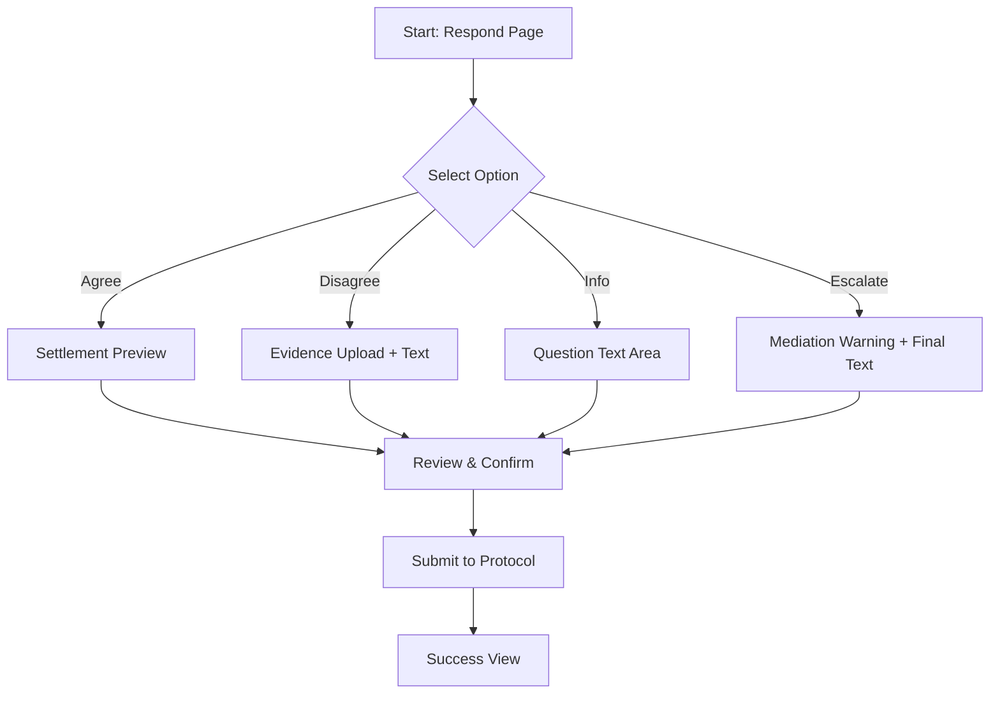

# Dispute Response Composer UX Specification

## Purpose
This specification defines the UI/UX for the Dispute Response Composer, used by businesses to address disputes filed by investors. It ensures a structured, secure, and clear communication channel while preserving the anonymity of both parties as per protocol requirements.

## Audience
- **Businesses**: To respond to claims with evidence or settlement offers.
- **Investors**: To receive and review the business's response (via an anonymous interface).
- **Mediators**: To review the full trail if escalation occurs.

## Composer Entry Point
- **Location**: `app/disputes/[id]/respond/page.tsx`
- **Trigger**: "Add Your Response" or "View & Respond" buttons from the Dispute Detail view or Dashboard Alerts.

---

## 1. Response Options (Radio Set)
The user must select one primary intent before providing details.

| Option | Label | Internal Action | Conditional Fields |
| :--- | :--- | :--- | :--- |
| `agree_settle` | Agree & Settle | Closes dispute, triggers refund | Settlement message, confirmation |
| `disagree_evidence` | Disagree & Provide Evidence | Keeps dispute open, awaits review | Evidence upload, detailed explanation |
| `request_info` | Request More Information | Keeps dispute open, notifies investor | Question for investor |
| `escalate` | Escalate to Mediator | Moves dispute to Mediation state | Reason for escalation, final evidence |

---

## 2. Composer States & Layout

### Default State (Selection)
- **Header**: Clear title "Respond to Dispute #DSP-ID"
- **Context**: Summary card of the dispute claim (Claim Category, Investor Message).
- **Deadline**: Visible countdown and exact timestamp.
- **Selector**: Vertical radio group with the four options listed above.

### Active Selection (Conditional)
Once an option is selected, the corresponding fields expand below.
- **Rich Text Area**: A `textarea` or rich-text editor for the explanation message.
- **File Upload**: Drag-and-drop zone for evidence (PDF, JPG, PNG).
- **Privacy Warning**: "Your response and files will be visible to the investor anonymously. Do not include PII."

---

## 3. Deadline Countdown
As per `defaults-spec.md`, avoid relative-only timestamps for critical deadlines.

**Display Component**:
- **Format**: `May 1, 2026, 14:30 UTC (2 days, 4 hours remaining)`
- **Color Logic**:
  - `> 48h`: Normal (Neutral/Gray)
  - `< 48h`: Warning (Orange/Yellow)
  - `< 12h`: Urgent (Red)

---

## 4. Evidence Upload
- **Requirements**:
  - Max file size: 10MB per file.
  - Allowed formats: PDF, JPEG, PNG.
  - Accessibility: Keyboard accessible `input[type="file"]` or via click on upload zone.
  - State: Show progress bars during upload; allow removal of files before submission.

---

## 5. Finality & Confirmation
Before submission, a modal or dedicated "Review" state must confirm the action.

**Confirmation Modal**:
> **Confirm Response Submission?**
> - Your response: [Selected Option]
> - Documents: [File-1.pdf, File-2.jpg]
>
> ⚠️ **Important**: Once submitted, this response is logged on-chain/in the audit trail and cannot be edited. It will be visible to the investor (anonymously).
>
> [Cancel] [Confirm & Send]

---

## 6. Security & Anonymity
- **Party Identification**: The composer must never show the Investor's real name or the Business's real name to the counterparty.
- **Document Scrubbing**: UI should warn users to remove personal info from PDF/images before uploading.
- **Audit Logging**: Every transition (Save Draft, Submit) must be logged with a server-side timestamp.

---

## 7. Responsive Behavior

### Mobile (375px)
- Linear layout.
- Large tap targets for radio options.
- Upload zone becomes a simple button + file list.
- Header remains sticky with the deadline countdown.

### Desktop (1280px)
- Two-column layout if context is large:
  - Left: Dispute Summary & Timeline.
  - Right: Response Composer.
- Large rich-text area for detailed evidence explanation.

---

## 8. Copy & Microcopy
- **CTA**: "Submit Response"
- **Success State**: "Response submitted. The investor has been notified. Current state: Under Review."
- **Empty State (Response already sent)**: "You have already responded to this dispute. [View Your Response]"

---

## Interaction Flow (Mermaid)

