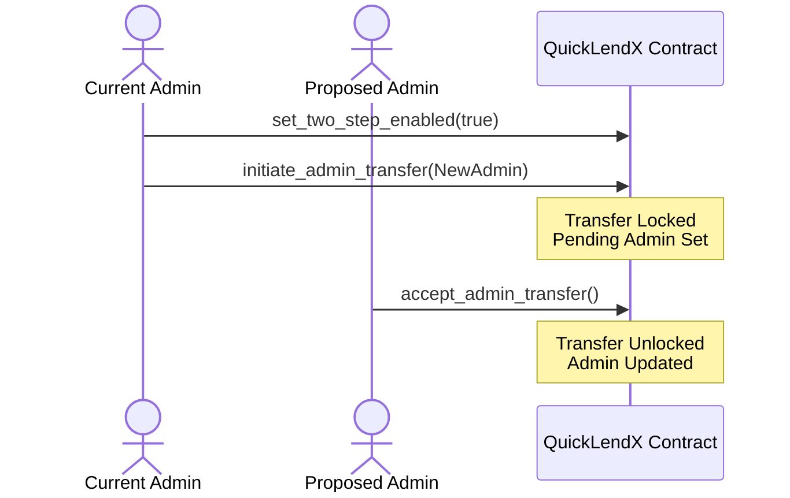

# Hardened Admin Role Transfer

Admin key handoff is the single most critical and sensitive governance operation in the QuickLendX protocol. The smart contracts support two modes of admin role transfers: **Direct (One-step)** and **Two-step Handoff**. 

---

## Direct vs. Two-Step Handoff

### 1. Direct Transfer (One-Step)
In a direct transfer, the current admin immediately appoints a new address as the administrator.
- **API Call**: `transfer_admin(new_admin)`
- **Execution**: Instantaneous. The `admin` storage slot is immediately updated to the `new_admin` address.
- **Risk**: High. If the current admin makes a typo or provides an incorrect, inaccessible, or blackhole address, ownership of the protocol is lost forever with no recovery path.

### 2. Two-Step Handoff (Recommended for Production)
The two-step flow mitigates the risk of single-point errors by forcing the proposed new admin to explicitly claim/accept the role before ownership is transferred.
- **API Flow**:
  1. Current admin calls `initiate_admin_transfer(pending_admin)`.
  2. The contract records `pending_admin` and engages a **transfer lock**.
  3. The proposed `pending_admin` must authorize and call `accept_admin_transfer()`.
- **Safety**: 
  - Prevents accidental transfers to incorrect or uncontrolled addresses (since the recipient must prove they can sign on behalf of the new key).
  - The current admin retains full authority and can cancel the pending transfer at any time prior to acceptance using `cancel_admin_transfer()`.

---

## The Transfer Lock Interaction

When a two-step transfer is initiated, the contract sets a internal flag `ADMIN_TRANSFER_LOCK_KEY` to `true`.
While this lock is active:
- Direct transfers via `transfer_admin` are blocked.
- Any attempt to overwrite or re-initiate a pending transfer is blocked.
- The lock is cleared under only two conditions:
  - The pending admin successfully accepts the transfer, completing the transition.
  - The current admin explicitly cancels the transfer, returning the contract to its normal state.

---

## Recommended Production Procedure

For production deployments, operators should exclusively use the **Two-Step Handoff**:

### Step-by-Step Operator Guide

1. **Verify State & Mode**:
   Ensure two-step mode is enabled on the contract:
   - Call `is_two_step_enabled()`.
   - If not enabled, the current admin must call `set_two_step_enabled(true)`.

2. **Initiate Transfer**:
   The current admin initiates the transfer:
   - Call `initiate_admin_transfer(pending_admin)`.
   - Verify that `is_transfer_locked()` returns `true` and `get_pending_admin()` returns the expected address.

3. **Acceptance by the New Admin**:
   The proposed new admin signs and submits the acceptance:
   - Call `accept_admin_transfer()`.
   - Verify that `get_current_admin()` now returns the new admin address, `is_transfer_locked()` is `false`, and `get_pending_admin()` is `None`.

4. **Emergency Cancellation**:
   If an incorrect address was proposed or the transfer needs to be aborted:
   - The current admin calls `cancel_admin_transfer()`.
   - The pending state is cleared, the lock is released, and full authority remains with the original admin.
