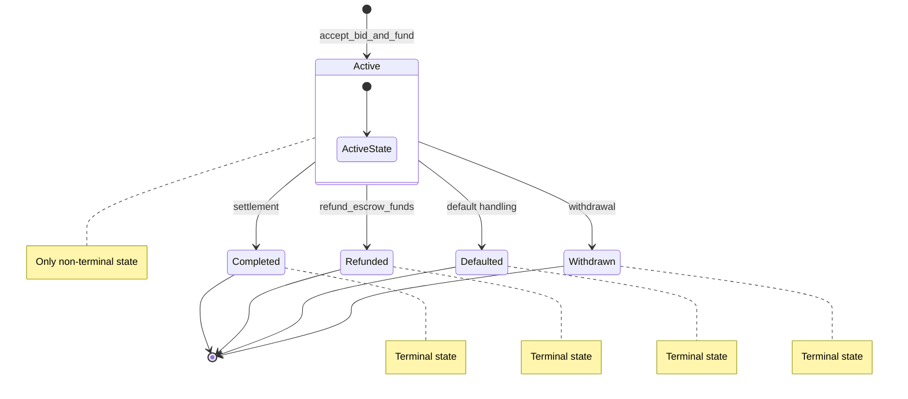

# Investment Lifecycle and State Machine

This developer guide describes the lifecycle of an investment in the QuickLendX protocol, detailing the `InvestmentStatus` state machine, legal transitions enforced by `InvestmentStatus::validate_transition()`, driving entrypoints, and coupling to invoice and escrow states.

## Overview

The `Investment` state tracks an investor's funded position in the protocol. It is governed by a strict state machine to prevent orphaned active investments, double-refunds, and other transition exploits.

## Investment Statuses

`InvestmentStatus` is defined as:

```rust
pub enum InvestmentStatus {
    Active,
    Withdrawn,
    Completed,
    Defaulted,
    Refunded,
}
```

*   **`Active`**: The investment is active, funded, and tracked in the active investment index. This is the only non-terminal state.
*   **`Withdrawn`** (Terminal): The investment has been withdrawn by the investor.
*   **`Completed`** (Terminal): The associated invoice has been successfully settled/paid in full, and the investor has received their expected principal and returns.
*   **`Defaulted`** (Terminal): The associated invoice has failed to settle within its grace period, transitioning the investment to a defaulted state and triggering insurance payouts.
*   **`Refunded`** (Terminal): The associated invoice/escrow has been cancelled or refunded, returning the investment funds to the investor.

---

## State Diagram



---

## Legal Transitions

All state transitions are validated through `InvestmentStatus::validate_transition()`.

*   **`Active`** is the only state that can transition. It can transition to any of the terminal states: `Completed`, `Defaulted`, `Refunded`, or `Withdrawn`.
*   All other states (`Completed`, `Defaulted`, `Refunded`, `Withdrawn`) are **terminal** and immutable. No transitions from these states are permitted.

| From State | To State | Driving Entrypoint / Trigger | Description |
| :--- | :--- | :--- | :--- |
| **`Active`** | `Completed` | **`settlement`** (`settle_invoice` / `process_partial_payment` finalization) | Full invoice settlement is completed. Funds are distributed to investor (return) and platform (fees). |
| **`Active`** | `Refunded` | **`refund_escrow_funds`** | Escrow funds are refunded back to the investor. |
| **`Active`** | `Defaulted` | **`default handling`** (`handle_default` / `mark_invoice_defaulted`) | Invoice due date + grace period expires. Triggers default handling and deactivates/claims insurance policies. |
| **`Active`** | `Withdrawn` | **`withdrawal`** (e.g. withdrawal/cancellation flow simulation) | Investor initiates withdrawal of their investment funds. |
| **`Completed`** | *(none)* | *(immutable)* | Terminal state. |
| **`Refunded`** | *(none)* | *(immutable)* | Terminal state. |
| **`Defaulted`** | *(none)* | *(immutable)* | Terminal state. |
| **`Withdrawn`** | *(none)* | *(immutable)* | Terminal state. |

---

## Status Coupling

The investment state is coupled directly to the corresponding `InvoiceStatus` and escrow state:

| Investment Status | Invoice Status | Escrow Status / State | Description |
| :--- | :--- | :--- | :--- |
| **`Active`** | `Funded` | `Held` | The bid has been accepted and escrow is funded. |
| **`Completed`** | `Paid` | `Released` (or empty) | Invoice is fully paid, and escrow is released to the business owner. |
| **`Refunded`** | `Refunded` | `Refunded` | Escrow is returned to the investor, and invoice status is updated to `Refunded`. |
| **`Defaulted`** | `Defaulted` | `Held` (or claimed/empty) | Grace period expired. Escrow is frozen or processed, and insurance claims are paid. |
| **`Withdrawn`** | `Cancelled` | `Refunded` | Invoice is cancelled, and investment funds are withdrawn/refunded. |

---

## Storage & Invariants

1.  **Active Investment Index (`act_inv`)**:
    *   Contains ONLY investments with `status == InvestmentStatus::Active`.
    *   During any transition leaving the `Active` state, the investment is atomically removed from this index via `remove_from_active_index()`.
2.  **Orphan Prevention**:
    *   `validate_no_orphan_investments()` runs checks to ensure that all investments in the active index are indeed in the `Active` state, protecting against index drift.
