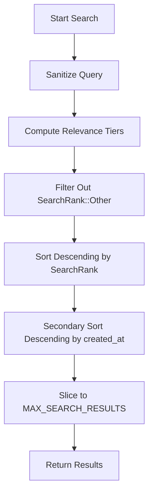

# Invoice Search Relevance-Ranking Model

This document outlines the relevance ranking and ordering model implemented in the QuickLendX search subsystem (`InvoiceSearch::search_invoices`). Integrators building search interfaces, dashboard frontends, or automated monitoring tools should consult this guide to understand how results are ordered.

---

## Relevance Ranking Tiers (`SearchRank`)

When a search query is submitted, it is first sanitized (lowercase, printable ASCII, stripped punctuation) and then evaluated against all registered invoices. The contract classifies each match into one of three relevance tiers:

| Tier | Enum Variant | Matches On | Priority | Description |
| :--- | :--- | :--- | :--- | :--- |
| **Tier 1** | `SearchRank::ExactId` | Hex representation of Invoice ID | **Highest** | Surfaced first. An exact ID match indicates the user is searching for a specific record. |
| **Tier 2** | `SearchRank::PartialMatch` | Description or Customer Name | **Medium** | Surfaced next. A substring match (case-insensitive) on the invoice description or customer name. |
| **Tier 3** | `SearchRank::Other` | None | **None** | Excluded from the final search results. |

---

## Sorting and Ordering Algorithm

The query returns up to `MAX_SEARCH_RESULTS` (default: 50) sorted deterministically according to the following priorities:

1. **Relevance Rank (Descending)**: Results with higher ranking tiers always appear before lower tiers (i.e., `ExactId` > `PartialMatch`).
2. **Creation Timestamp (Descending)**: For results sharing the same ranking tier, the contract applies a secondary sort on `created_at` timestamp. Newer invoices are surfaced before older ones.
3. **Stability**: The sorting algorithm preserves relative order for items matching both tier and timestamp (stable sort).

---

## Integrator Best Practices

- **Case-Insensitive UI**: The contract automatically sanitizes queries and converts them to lowercase. UI elements do not need to convert queries before invoking the contract search.
- **ID Formatting**: If a user is searching by invoice ID, supply the full 64-character hex string of the `BytesN<32>` ID. This triggers the `ExactId` tier and guarantees that specific invoice surfaces first.
- **Result Limits**: The result vector is capped at 50 elements by the contract to ensure predictable WASM memory usage and low gas consumption.
